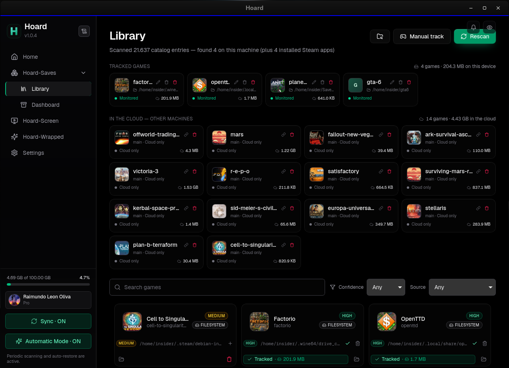
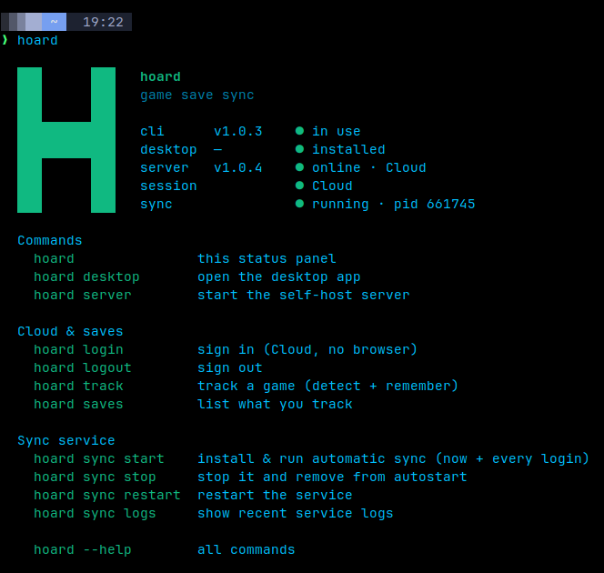

# Hoard

  

> Steam Cloud is not a backup strategy. Hoard is.

**Hoard is an open-source (AGPL-3.0) game save backup and sync system.** Run the
server on your own hardware, or use [Hoard Cloud](https://hoard.services) hosted
in the EU — the desktop app and the CLI work the same against either. Self-hosting
needs no Hoard account and has no quota beyond your own disk.

> *Ships in eight languages, Spanish included.*

Steam Cloud, GOG Galaxy and friends work fine — right up until they overwrite
a 200-hour save with a corrupted one from another machine, the publisher
kills the service, or the game just isn't covered. Hoard is the boring,
paranoid alternative: it snapshots your saves every time you stop playing,
hashes every file, and lets you roll back to any earlier version or pull
your entire library onto a fresh machine. Nothing is ever silently
overwritten — that's the entire point.

Auto-detects your games. Watches your saves. Syncs in the background.
Rolls back when things go wrong. That's it. That's Hoard.

*Necessity is the mother of invention — I created **Hoard** because I needed it.*

| Feature | What it means for you |
|---------|----------------------|
| **Versioned** | Every session = new snapshot. Roll back to *any* previous version. Old saves never expire (self-hosted) or until you hit your quota (Cloud). |
| **Verified** | Every file SHA256-hashed on upload, re-verified on restore. Corruption caught before it overwrites your good save. |
| **Compact** | Content-hash deduplication: 10 versions of a 2 GB save cost ~2 GB, not 20 GB. Transfers are zstd-compressed; restores byte-for-byte (SHA-256 verified). Since 1.1.3 the same dedup applies on upload: a second backup of the same game moves only the files that changed — megabytes, not the whole folder. |
| **Auto-detect** | 20,000+ games from the Ludusavi manifest + your Steam libraries + running processes + filesystem scan. Zero config for normal games. |
| **Emulator support (beta)** | PCSX2, RPCS3, DuckStation, PPSSPP, Dolphin, Cemu, Ryujinx, yuzu, Citra/Azahar, RetroArch, mGBA, melonDS, Project64, shadPS4, Vita3K, Eden, Suyu, Citron, Sudachi, xemu and Flycast. Pick from presets, tracked like any other gam -- you can manually add others. |
| **Cross-platform** | Windows · Linux · macOS. One click install, no compiler, no dependencies -- Steam Deck compatible |
| **In-app updates** | New release? The app downloads the right installer for your OS and installs it with one click (signed, verified). Self-hosted servers upgrade in place with `hoard-server upgrade`. |
| **Presence** | See which of your machines are online right now and what each one is playing, live — the Eye panel, self-hosted included. |
| **Self-hosted storage** | The server keeps your blobs on local disk or any S3-compatible bucket — MinIO, Backblaze B2, Cloudflare R2, or an `rclone serve s3` bridge in front of OneDrive/Drive/Dropbox. |

Available on Windows, Linux, and macOS. 
Also includes a headless CLI — the sync engine (`hoardd`) runs as a background
service and the terminal (`hoard`) talks to it. Perfect for servers and Steam
Decks. No desktop required, just set it and forget it.

## Cloud, self-hosted, or both

One codebase, two ways to run it:

- **Hoard Cloud** — the hosted service at [hoard.services](https://hoard.services).
  Sign in with Google, install the app, done. Free tier: 2 GB, 3 devices,
  full version history — free forever.
- **Self-hosted** — run the same `hoard-server` binary on your own box and
  point the app at it. No account, no quota — just your cloud.

Pro (from 1.99 €/month) gives you 100 GB — [I don't profit from it](https://github.com/rleeon/hoard). It unlocks
**Hoard Screen**, an in-game overlay to browse and roll back snapshots without
alt-tabbing. Free includes a 1-week trial.

**Hoard Wrapped** is completely free — just a Spotify-Wrapped-style recap of
your year in games.

Pricing and free trial at [hoard.services/pricing](https://hoard.services/pricing).

## What devices does Hoard work on?

Works in any plataform -- except phone, you can install in: [hoard.services/download](https://hoard.services/download)

If you are in gamemode in steamos/brazzite/cachyos the same installer puts the app,
the engine and the terminal in one pass — [Hoard-CLI](https://hoard.services/cli) is just the terminal face.

|

v

## One installer, whatever your machine is

Hoard is an engine (`hoardd`) plus two faces: the terminal (`hoard`) and the
app. The installer works out which ones your machine wants and puts them all in
at the same version — a NAS or a server stops at the engine and the terminal, a
desktop or a Steam Deck gets the app too, in the same pass. Upgrades move
everything together, so the pieces can't drift apart.

In game mode there is nothing to keep open: the engine runs as a background
service that starts with your session, so your saves sync with no window and no
terminal.

Prefer the terminal, or running on a headless box (NAS / server / Steam Deck)?
Add `--headless` and it never fetches the app. Everything ships as standalone
binaries with no GUI deps.
Download it in [cli latest release](https://hoard.services/cli):

Or just install it using:

Linux: 

curl -fsSL https://raw.githubusercontent.com/rleeon/hoard/main/web/static/install.sh | sh

Windows: 

irm https://raw.githubusercontent.com/rleeon/hoard/main/web/static/install.ps1 | iex

## Documentation

- **[Self-hosting guide](SELF-HOST_GUIDE.md)** — Docker, bare-metal + systemd, and the headless CLI.
- **[Contributing](CONTRIBUTING.md)** — building from source, the release flow, and the architecture.
- **[Funding](FUNDING.md)** — where the money goes and what your sponsorship covers.

# ❤️ Support Hoard ❤️
Hoard is free and open-source. Your support helps cover server costs and funds development.

[Sponsor on GitHub](https://github.com/sponsors/rleeon) · [Funding breakdown](FUNDING.md)
