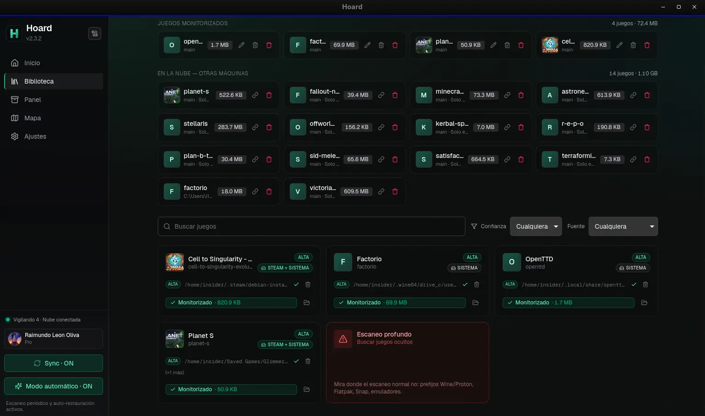

# Hoard

[](https://github.com/rleeon/hoard/actions/workflows/ci.yml)
[](https://github.com/rleeon/hoard/releases/latest)
[](LICENSE)

> Steam Cloud is not a backup strategy. Hoard is.



*(Yes, that's Spanish — my daily driver. Ships in eight languages, English
included.)*

Steam Cloud, GOG Galaxy and friends work fine — right up until they overwrite
a 200-hour save with a corrupted one from another machine, the publisher
kills the service, or the game just isn't covered. Hoard is the boring,
paranoid alternative: it snapshots your saves every time you stop playing,
hashes every file, and lets you roll back to any earlier version or pull the
whole library down onto a fresh machine. Nothing is ever silently
overwritten — that's the entire point of the exercise.

The desktop app (Windows · Linux · macOS) auto-detects installed games,
watches the save folders, and syncs in the background. A headless `hoard`
CLI does the same on servers and Steam Decks, no window manager required.

## Cloud, self-hosted, or both

One codebase, two ways to run it:

- **Hoard Cloud** — the hosted service at [hoard.services](https://hoard.services).
  Sign in with Google, install the app, done. Free tier: 1 GB, 3 devices,
  full version history — the free part doesn't expire either.
- **Self-hosted** — run the same `hoard-server` binary on your own box and
  point the app at it. No account, no quota but the disk you give it.

Pro isn't sold by the gigabyte — most save files are a few MB, and 1 GB free
covers that fine. What Pro (from 1.49 €/month) actually unlocks is two
things: **Hoard Screen**, an in-game overlay to browse and roll back
snapshots without alt-tabbing, and **Hoard Wrapped**, a
Spotify-Wrapped-style recap of your year in games. Current pricing and a
free trial are at [hoard.services/pricing](https://hoard.services/pricing).

## Why

- **Versioned** — every backup is a new snapshot; old versions don't expire.
- **Verified** — every file's SHA256 is stored and re-checked on restore.
- **Compact** — snapshots stream as zstd-compressed tar; the server dedups by
  content hash.
- **Auto-detect** — 20,000+ games via the Ludusavi manifest, plus filesystem,
  Steam library and running-process detection.
- **Emulator support (beta)** — PCSX2, RPCS3, DuckStation, PPSSPP, Dolphin,
  Cemu, Ryujinx, Citra/Azahar, RetroArch, mGBA, melonDS, Project64: pick
  yours from a preset list, and from then on it's watched and backed up
  automatically like any other tracked game. Beta because finding *where*
  an emulator keeps its saves isn't automatic yet — the sync itself is.
- **Cross-platform** — pre-built installers; no compiler needed.
- **In-app updates** — when a newer release ships, the app offers to install
  the right asset for your OS.

## Get the app

You don't need to compile anything. Grab an installer from the
[**latest release**](https://github.com/rleeon/hoard/releases/latest) or from
[hoard.services/download](https://hoard.services/download):

| Platform | File |
| --- | --- |
| Windows 10 / 11 | `Hoard_<version>_x64-setup.exe` (installer) or `…_x64_en-US.msi` |
| Linux (Debian / Ubuntu) | `Hoard_<version>_amd64.deb` |
| Linux (Fedora / openSUSE) | the `.rpm` asset on the release page |
| Linux (any distro) | `Hoard_<version>_amd64.AppImage` |
| macOS (Apple Silicon only) | `Hoard_<version>_aarch64.dmg` |

No Intel Mac build at the moment — GitHub retired the runner that used to
produce it. On an Intel Mac, self-host the server or build the desktop app
from source below; nothing about the app itself is Apple-Silicon-only.

First launch warns on Windows SmartScreen and macOS Gatekeeper — the app
isn't code-signed yet. Click through.

## Self-host

Run the server once; every machine you install the app on connects to it.

### Docker

```sh
git clone https://github.com/rleeon/hoard.git && cd hoard
mkdir -p deploy/docker/config
cp deploy/config.toml.example deploy/docker/config/config.toml
$EDITOR deploy/docker/config/config.toml      # set public_url at minimum

cd deploy/docker
docker compose up -d --build
docker compose logs -f                        # wait for "listening"

# create your user + a token for the desktop app
docker compose exec server hoard-admin --config /etc/hoard/config.toml \
    user create alice --admin --password 'CHANGE_ME'
docker compose exec server hoard-admin --config /etc/hoard/config.toml \
    token create alice --device 'desktop'
# save the printed token now — it cannot be retrieved later
```

In the app's onboarding, pick **Autohost**, paste the server URL and token.

### Bare metal + systemd

```sh
git clone https://github.com/rleeon/hoard.git && cd hoard
sudo ./deploy/scripts/install.sh
sudo $EDITOR /etc/hoard/config.toml
sudo -u hoard hoard-admin --config /etc/hoard/config.toml db migrate
sudo -u hoard hoard-admin --config /etc/hoard/config.toml \
    user create alice --admin --password 'CHANGE_ME'
sudo systemctl start hoard-server
```

Upgrade later with `sudo hoard-server upgrade`: it swaps the binary
atomically and prints the `systemctl restart` step (it won't restart the
service itself, so an in-flight sync isn't killed).

## Headless CLI

```sh
hoard config init --server http://YOUR_SERVER:8080
hoard login --token hoard_v1_...
hoard save create --game stardew-valley --label main
hoard backup <SAVE_ID> --from ~/.config/StardewValley/Saves --remember
hoard snapshots list <SAVE_ID>
hoard restore <SAVE_ID>
```

## Architecture

A Rust workspace of 8 crates:

| Crate | Role |
| --- | --- |
| `hoard-core` | shared types, hashing, file-walk primitives |
| `hoard-manifest` | Ludusavi manifest parser |
| `hoard-watcher` | filesystem + process watchers (reusable lib) |
| `hoard-agent` | sync engine: backup, restore, detection; talks to the server |
| `hoard-cli` | the headless `hoard` binary |
| `hoard-admin` | server-side admin CLI (users, tokens, db) |
| `hoard-server` | Axum HTTP server; owns the DB and storage |
| `hoard-desktop` | Tauri 2 + Svelte 5 desktop app wrapping `hoard-agent` |

`hoard-server` runs in two modes from one binary. Self-hosted uses SQLite +
on-disk snapshots under `data_dir`, with bearer-token auth and the
`/v1/saves` API. Built with `--features cloud` it becomes **Hoard Cloud**:
Postgres + Cloudflare R2 object storage, Supabase JWT auth, and a
presigned-upload `/v1/cloud/*` API. The client picks the right protocol from
`/v1/health`'s `mode` field. The marketing + account site lives in `web/`
(SvelteKit, deployed to GitHub Pages).

Two more crates — the in-game overlay behind Hoard Screen and the recap
engine behind Hoard Wrapped — live in a private repo and get linked in at
build time behind a `pro` feature flag. Public builds compile fine without
them (stubbed out); the subscription check itself lives server-side, not in
the client, so there's nothing to patch out locally.

## Building from source

```sh
# Server / CLI / admin
cargo build --release -p hoard-server -p hoard-cli -p hoard-admin

# Desktop app (needs Node 20 + pnpm 9 + Tauri prerequisites)
pnpm --dir crates/hoard-desktop/ui install
cargo install tauri-cli --version '^2'
cargo tauri build --manifest-path crates/hoard-desktop/Cargo.toml
```

Linux build prerequisites: `libwebkit2gtk-4.1-dev`, `build-essential`,
`curl`, `wget`, `file`, `libssl-dev`, `libayatana-appindicator3-dev`,
`librsvg2-dev`, `patchelf`. See `.github/workflows/release-desktop.yml`
for the canonical list.

## Releasing

The version lives in three files (`Cargo.toml`, `tauri.conf.json`,
`ui/package.json`). Don't edit them by hand — stamp all three from one number:

```sh
node scripts/stamp-version.mjs 1.8.6   # or no arg to use the latest git tag
git commit -am "release: 1.8.6" && git tag v1.8.6 && git push --tags
```

The version shown on the website and in the app's update check is read live
from [`releases/latest`](https://github.com/rleeon/hoard/releases/latest), so
once the tagged release is published everything reports the same number with
no further edits.

## License

AGPL-3.0 — see [LICENSE](LICENSE). Run a modified version as a network service
and the AGPL requires you to publish your changes under the same license.
