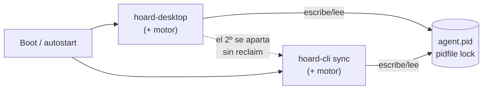
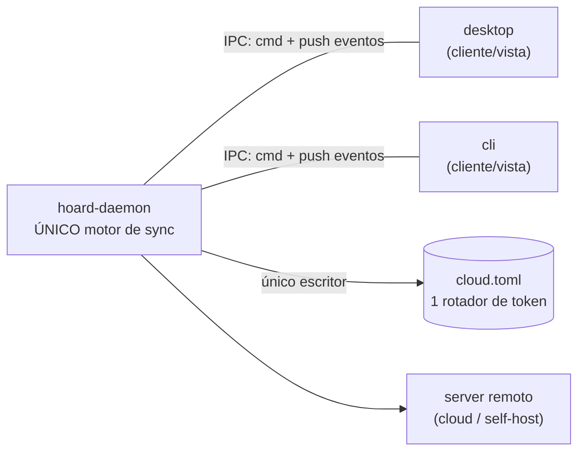

# 0021 — Servicio local + clientes finos (desktop/CLI como vistas)

- **Estado:** Propuesta — 2026-07-23
- **Origen:** conversación de arquitectura. La Parte A (topología de procesos)
  la propuso el usuario; la Parte B (saneamiento interno del motor) sale del
  diagnóstico previo. Se documentan juntas porque se tocan, pero se pueden
  ejecutar por separado.

---

## Parte A — Un servicio local dueño del motor

### Problema

Hoy el motor de sync (`hoard_agent::agent::spawn`) va **embebido en dos
binarios**: `hoard-desktop` (`crates/hoard-desktop/src/commands/agent.rs:227`) y
el daemon CLI `hoard sync` (`crates/hoard-cli/src/commands/daemon.rs:151`). Cada
proceso corre su propia copia del motor.

Como dos motores a la vez causan ping-pong de backup/restore y reuse-detection
del refresh token de Supabase (401, porque ambos rotan **el mismo** token en
`cloud.toml`), existe un árbitro: `hoard_agent::instance` — un **pidfile**
(`<state_dir>/agent.pid`). El primero que arranca lo toma; el segundo ve al
dueño vivo (`live_owner()`) y **se aparta sin arrancar su motor**.

Ese árbitro es un parche con fallos de **diseño**, no de implementación:

- **Race de arranque.** Al encender el PC, el daemon CLI (si está configurado
  para arrancar en boot) y el autostart del desktop compiten. Quien llega
  primero a `AgentLock::acquire()` gana; el otro se aparta.
- **No hay reclaim.** El chequeo `live_owner()` es *one-shot*, al arrancar. Si
  ganó la CLI y luego la paras (`hoard sync stop`), el desktop que se apartó
  **no se entera de que el dueño murió** y no retoma el motor. El sync muere en
  silencio hasta reiniciar el desktop. **Éste es el bug que motiva la ADR:
  "paro la CLI y el desktop no vuelve".**
- **El ciclo de vida del motor está atado a una UI.** Cierras la app y el motor
  se va con ella (salvo que el dueño fuera la CLI). Dos frontends no pueden
  coexistir limpiamente; el sync de fondo depende de que "el proceso correcto"
  siga vivo.
- **Multi-escritor sobre credenciales.** Que dos procesos puedan rotar el
  refresh token es la causa raíz de una familia de bugs cloud (401 / realtime
  enmudecido). El pidfile lo evita por exclusión, no por diseño.

No hay ninguna IPC local hoy (sin `UnixListener` / named pipe / socket): desktop
y CLI solo se coordinan por el pidfile + `state.json` en disco + el server
remoto.

### Decisión

Promover el motor a un **proceso propio de vida larga: un servicio local**
(`hoardd` / `hoard-daemon`, nombre a decidir). **Exactamente un motor por
usuario**, propiedad del servicio. `hoard-desktop` y `hoard-cli` dejan de
embeber `agent::spawn` y pasan a ser **clientes finos**: se conectan al servicio
por IPC local, pintan/imprimen lo que el servicio reporta y le mandan comandos.
Ninguno corre lógica de sync.

`hoard_agent::instance` (el pidfile) **desaparece**: el árbitro pasa a ser la
*propiedad del socket* del servicio — un mutex real con liveness, no un pidfile
que se consulta una vez.

#### Por qué arregla los bugs de raíz

- **Race de arranque:** desaparece. Ambos clientes hacen lo mismo e idempotente
  — "conéctate al servicio; si no hay, arráncalo". Bajo carrera, el que pierde
  el arranque simplemente se conecta al que ganó (el bind del socket resuelve el
  empate).
- **No-reclaim:** desaparece. Matar un cliente nunca mata el motor. Cerrar la
  app tampoco. El servicio sigue.
- **Multi-escritor de credenciales:** desaparece. Solo el servicio toca
  `cloud.toml` y rota el token → un único rotador → mata la familia
  401/realtime.

#### Ciclo de vida

- El servicio es el **único dueño** del sync y **sobrevive** al cierre de la UI
  (ese es el punto).
- Arranca por dos vías:
  - **En boot**, como **servicio de usuario**: systemd *user* unit (Linux),
    launchd *user agent* (macOS), Startup / Task Scheduler por-usuario (Windows).
  - **On-demand**: si la app o la CLI arrancan y no hay servicio, lo levantan
    ("spawn if absent", handshake idempotente; socket-activation en Linux si se
    quiere afinar).
- **Por-usuario, nunca system-wide.** Necesita el keyring del usuario y su login
  cloud. En máquina multiusuario, un servicio por sesión de usuario.
- **Residente:** se queda vivo aunque no haya clientes (es sync de fondo).
  "Arranca si la app/CLI arranca" significa *asegurar que está arriba*, no atar
  su vida a ellos.

#### Transporte IPC ("lo que menos consuma")

Un único protocolo que compartan ambos clientes (la CLI no puede usar la IPC de
Tauri, así que reutilizar esa queda descartado):

- **Opción A — socket local** (UDS en Linux/macOS, named pipe en Windows) con
  protocolo *framed* (p. ej. JSON con length-prefix) + un canal **push** para
  eventos en vivo. Es la de menor consumo y hace trivial el streaming de estado
  (la UI no pollea).
- **Opción B — HTTP en loopback**, reutilizando los tipos y el cliente que la
  app ya usa contra `hoard-server`. Más pesado, pero reutiliza mucho y se
  depura con `curl`.
- **Recomendación: A**, con el push como sustituto directo del `events_tx`
  in-process que hoy recibe `agent::spawn` (`agent.rs:227`, `daemon.rs:151`). El
  `AgentEvent` pasa a ser el **protocolo de eventos por cable** — converge con
  el saneamiento del contrato UI↔backend (Parte B, racimo 3).
- **Seguridad:** socket con permisos solo-usuario (0600 / ACL del named pipe)
  para que otro usuario local no maneje tu sync ni tus credenciales.
- **Versionado:** ahora hay 2+ artefactos actualizables (servicio + app + CLI)
  que deben hablar el mismo protocolo; versionar el handshake.

#### Migración por fases (sin romper releases)

0. Hoy: motor embebido en desktop y CLI.
1. Extraer `hoard-daemon`: binario que hace `agent::spawn` y expone la IPC.
   Convive con el path embebido actual.
2. Desktop → cliente: quita su `agent::spawn`, habla con el servicio, lo levanta
   si falta.
3. CLI: `hoard sync` pasa a "asegura servicio + attach"; los comandos one-shot
   pasan a llamadas IPC.
4. Borrar `instance.rs` (el pidfile): ya no hace falta, el socket es el árbitro.
5. Packaging por plataforma: systemd user unit / launchd agent / Windows.
   (`deploy/systemd` ya tiene units, pero son del **server remoto** — otra cosa;
   el patrón y el tooling existen.)

#### Riesgos / decisiones abiertas

- **Quién posee tray y notificaciones.** Hoy el tray es del desktop. Si el
  desktop es "solo un cliente", ¿quién notifica con la ventana cerrada?
  Opciones: (a) el desktop se queda residente en tray como cliente-UI
  siempre-vivo y el servicio lo alimenta; (b) el servicio manda notificaciones
  nativas del SO directo (notify-send / dbus en Linux). **Decidir.**
- **Credenciales / keyring:** el servicio debe poseer el refresh del JWT y el
  storage de creds (hoy lo hace el wrapper del desktop). Por eso es por-usuario.
- **Updater:** 2+ artefactos que versionar y mantener compatibles de protocolo.
- **Activación en Windows/macOS:** sin socket-activation limpia como systemd; el
  handshake "spawn if absent" es la respuesta portable.

---

## Parte B — Saneamiento interno del motor (relacionado, paralelo, menor urgencia)

Independiente de la Parte A, pero el límite del servicio presiona a definir bien
la superficie de comandos/eventos del motor, que es justo el racimo 3.

Los bugs recurrentes de las últimas sesiones caen en tres racimos, cada uno una
costura rota **dentro** de `hoard-agent` (25k líneas; `agent.rs` solo, 6.179):

1. **Máquina de estados del save (el grande).** sticky 90s→6s, auto-restore que
   se auto-vetaba, deferred-pull que no aterrizaba, correlación fantasma que
   envenena el slot, `is_running` sin escape. Todos son la misma cosa:
   transiciones mal hechas de una máquina de estados **nunca hecha explícita**;
   el estado vive disperso en flags/timestamps del `SaveSlot` y se reconstruye a
   mano en `mid_session_reason` / `process_poll`.
   → **Núcleo puro de política:** `enum` de estado + reductor
   `decide(estado, evento, contexto) -> (estado, Vec<Accion>)`, sin
   tokio/HTTP/sysinfo; `run_agent` queda como runtime que solo hace I/O y
   ejecuta acciones. Cada bug se vuelve un test de 5 líneas. Las piezas ya puras
   (`mid_session_reason`, `accept_correlation_signals`, merge de restore) ya
   tienen tests — **extender** el modelo, no inventarlo.
2. **Transporte cloud.** token realtime que enmudece, 429 manejado solo en
   backup y no en restore, blob EOF, hot-loop de compresión → blobs huérfanos.
   Retry/token/integridad duplicados entre backup y restore.
   → **Un solo cliente cloud** que centralice refresh de token + retry/throttle
   + integridad de blob. (La Parte A ya elimina el multi-escritor del token.)
3. **Contrato UI↔backend.** notificaciones que escuchaban un evento viejo,
   commands Tauri sin cablear, login state mismatch.
   → tipos compartidos **bajados a `hoard-core`** (hoy 179 líneas, casi vacío;
   todo depende del god-crate, al revés de como debería) y contrato de eventos
   **tipado** — que en la Parte A *es* el protocolo IPC.

`detection.rs` (3.410 líneas) es el otro monstruo, pero es un concern casi
independiente y no es epicentro de bugs; al final.

### Secuenciación sugerida

La Parte A (servicio) y B.1 (núcleo de política) son ortogonales; cualquier
orden vale. Pero fijar el límite del servicio obliga a definir la superficie
comando/evento del motor, así que **A primero deja B.3 medio hecho gratis**. B.2
se beneficia de A (un solo rotador de token). Orden pragmático:
**A → B.3 → B.1 → B.2 → detection.**

---

## Parte C — Kernel sin-IO + defensas contra regresiones

Refina la Parte B tras una segunda pasada. La idea de fondo: las defensas que
de verdad frenan el goteo de bugs del vibecodeo no son "reordenar cajas", son
**hacer el bug imposible o visible al instante**. Y todas colapsan en una sola
pieza.

### C.0 La síntesis: un kernel de dominio sin-IO

El reductor de B.1, los newtypes de B.3/C.3 y los tipos de wire de B.3/C.6 **no
tienen IO**. Y la simulación (C.2) solo es barata si eso es cierto. Luego existe
un **kernel de dominio determinista** —función de `(estado, mundo_observado,
now, seed)`— y todo lo demás (daemon runtime, DB, HTTP/reqwest, Axum, Tauri) son
*shells de IO* a su alrededor. Ese kernel es, por fin, lo que justifica
`hoard-core` (hoy 179 líneas casi vacías): crate *leaf*, solo `serde`, sin
`tokio`/`axum`/`sqlx`. Contiene newtypes validados, tipos de wire/IPC, el
reductor reconciliador y el tipo `Scenario`. Es lo único que el simulador
maneja. **No son seis defensas: es un kernel + su banco de pruebas.**

### C.1 Reconciliador con la autoridad invertida

El loop actual ya es `tokio::select!` sobre `fs_rx` + un tick con `process_poll`
(`agent.rs:1027`, `agent.rs:4366`). El cambio no es un trasplante: **el tick
pasa a ser la fuente de verdad y los eventos (fs, realtime) quedan como hints
que adelantan el tick.** Matices load-bearing:

- **`spec` vs `status`.** La entrada del reconciliador no es solo el mundo
  muestreado; es el mundo **más su propia memoria durable**. Dos piezas que a
  primera vista parecían distintas son lo mismo (memoria propia, no mundo):
  - un **journal de hechos** (sesión empieza/acaba): playtime y "la sesión
    terminó" no se reconstruyen mirando la realidad actual; si los fuerzas al
    modelo puro de convergencia, los doble-cuentas o los pierdes.
  - las **operaciones en curso**: subir GB tarda minutos; sin esto, cada tick
    relanza el upload. La idempotencia sola no basta.
- **Anti-relaunch robusto a crash.** Un flag local "en curso" queda *stale* tras
  un crash. No lo resuelvas con estado local: resuélvelo **contra la verdad del
  server**. El storage es content-addressed, así que relanzar un upload ya
  aterrizado es un check de existencia barato (lookup en las tablas
  `blobs`/`chunks`), no un re-upload. Es el mismo principio que ya se aprendió en
  descarga (el fix de blob-EOF con reintento por-blob SHA-verificado); el
  reconciliador lo generaliza a la subida.
- **Observación por niveles** (Deck, batería): L0 = `stat` de mtime/size cada
  tick (barato); L1 = hash **solo** si L0 cambió o un hint enfocó ese save.
  Nunca re-hashear todo cada tick.
- **Invariante base:** convergido ⇒ solo `Hold`, cero acciones. Mata el
  hot-loop de compresión (1,29M ops en R2) — esa clase entera muere aquí.

### C.2 Sans-IO = inyectar TODO el no-determinismo

La simulación solo es gratis si el kernel es sans-IO **de verdad**, y casi todos
los bugs de timing (sticky 90s, auto-veto 5min, throttle con jitter,
min-interval) dependen del reloj. El kernel recibe `now` como entrada y **jamás**
llama a `Instant::now()` — **y también recibe el `seed` del rng**: el jitter del
throttle es aleatorio, con `thread_rng` la sim y el replay dejan de ser
deterministas. Ese es el refactor de verdad; la simulación viene gratis después.

- **Payoff:** time-travel en test (salto el reloj 5 min → pruebo el auto-veto
  sin esperar). Los bugs de timing pasan a triviales.
- **Método:** corpus primero (cada bug reciente = escenario determinista fijo),
  luego `proptest` con secuencias aleatorias + shrinking.
- **Invariantes:** las propuestas (converged ⇒ 0 acciones; storage acotado por
  tick) más el sharpening de la primera: su forma testable es **"ninguna acción
  sin un delta en la entrada que la cause"** (el hot-loop emitía acciones sin
  cambio de input). Ojo: `now` cruzando un deadline **es** un delta —por eso el
  retry tras un 429 no viola la invariante—. "Storage acotado por tick" se queda
  como guarda dura adicional.

### C.3 Newtypes con la puerta en `serde`

El veneno entró por **datos persistidos** (store envenenado, el "setup"), no por
código construyendo mal. Un `GameSlug` que valida en `new()` pero deriva
`Deserialize` a pelo no habría parado la correlación fantasma. Por tanto la
única vía de construcción —incluida la deserialización— debe pasar por el parse
validante: **no derivar `Deserialize`, usar `#[serde(try_from = "String")]`** →
una sola puerta imposible de saltar. Prioridad: los que cruzan serialización
(`GameSlug`, `Username`, `SaveId`, `Sha256`, `MachineId`).

- **Hazard de upgrade:** un `try_from` estricto sobre estado ya persistido
  **brickea** el estado viejo (el veneno ya está en disco → el daemon no carga).
  El serde-gate protege lo nuevo; lo viejo se **cleansea en la migración de
  C.4** (re-derivar el slug, loggear, marcar), nunca rechazar en duro. Van
  juntos.

### C.4 Estado en SQLite, detrás del daemon

Secuenciado **tras la Parte A**: el argumento "único escritor" solo es cierto
cuando `hoardd` es el único proceso que abre la DB. Antes del daemon tendrías
desktop + CLI abriendo SQLite multi-proceso en Windows (locking de fichero +
antivirus) y habrías cambiado una clase de bugs por otra.

- **Regla que hace real el single-writer:** la DB es **privada del daemon**; los
  clientes **nunca** la tocan, ni en lectura (read-only también choca con
  locking/AV en Windows). Todo acceso a estado va por la IPC. La DB es detalle
  interno del daemon, no fichero compartido.
- **Prefs dentro, sin excepción "editable a mano"** — la pref de 2s sobrevivió
  precisamente por ser fichero suelto.
- `rusqlite` a secas en vez de arrastrar `sqlx` async (ops de estado pequeñas y
  síncronas; no colorean de async el borde del kernel). **WAL** para commit
  atómico + durabilidad a crash. Migraciones versionadas (aquí vive el cleanse
  de C.3). Mata nonce/pref/store de golpe.

### C.5 Log de decisiones = corpus de replay

Si el kernel es puro, la terna de entrada es el formato del simulador de C.2. La
clave está en **qué** se graba: **las entradas** `(observación, now, seed)`, **no
la decisión**. Grabar-y-derivar: reproducir la traza contra el kernel-buggy
reproduce el bug; contra el kernel-parcheado **prueba el fix** — sobre la traza
real del Deck. (La decisión grabada se guarda como *aserción* para detectar
divergencia, pero la verdad del replay son las entradas.)

- **`Decision::{ Act(Action), Hold(reason) }`** — el veto es decisión de primera
  clase con motivo. Sticky y auto-veto vivían en el "no actuar"; así aparecen en
  el log y la invariante "convergido ⇒ solo `Hold`" es chequeable.
- Tabla-anillo en la SQLite de C.4 (queryable; `logship` la envía tal cual).
- **Privacidad:** contiene rutas y nombres de juego → redacción u opt-in antes
  de subir a cloud.

### C.6 Wire types en `hoard-core`, no crate nuevo

Viven en el mismo kernel leaf junto a los newtypes de C.3 (`serde`-only, sin
`tokio`/`axum`). El drift `agent::api` ↔ `server::routes` se convierte en error
de compilación. Pero **la coherencia de compilación solo vale dentro de un
build**: cliente y server se despliegan por separado, así que sigue haciendo
falta compat de wire entre versiones → append-only, `#[serde(default)]`, nunca
quitar/repurpose un campo, versión en el handshake (ya prevista en la Parte A
para la IPC), y un **test golden** de round-trip del JSON de la última release
para cazar rupturas.

### Cómo encaja con B

C reemplaza el "state machine limpio" de B.1 por el reconciliador; unifica B.3 y
B.6 en el kernel leaf; y añade las defensas nuevas (C.2 simulación, C.4 SQLite,
C.5 replay). Secuencia actualizada:
**A (daemon) → C.4 (estado en SQLite, ya con daemon) → C.1+C.2 (kernel
reconciliador + sans-IO + sim) → C.3 (newtypes) → C.5 (log/replay) → B.2 (cliente
cloud) → detection.**

(Ese orden es conceptual. El orden de **entrega** real, optimizado por
riesgo/shippability, es el de la Parte D y **manda** para ejecutar.)

---

## Parte D — Alcance, orden de entrega y protocolo de delegación

La implementación se delega a sesiones Opus, **un slice por sesión**. Esta parte
es el contrato que cada agente lee antes de tocar nada.

### D.0 Cómo entregar (meta)

- **No** en un solo task gigante ("haz toda la arquitectura"): reproduce el
  vibecodeo que queremos matar — pierde coherencia, no cabe en contexto, diff
  inrevisable.
- **No** en paralelo por partes: dependencias duras (SQLite ⟵ daemon ⟵ kernel de
  fiar; la migración lo bloquea todo) y las costuras entre agentes driftan
  (racimo 3).
- **Sí:** un slice por sesión, secuencial, verificado —y opcionalmente
  desplegado— antes del siguiente. Cada agente arranca leyendo **esta ADR +
  `CLAUDE.md`**; la ADR es la memoria compartida, así que un Opus fresco por
  slice se mantiene coherente sin heredar la conversación de diseño.

### D.1 Prerrequisitos (antes del Slice 1)

1. **Aterrizar el WIP.** Commit + release de todo lo "sin commitear/sin
   desplegar". Refactorizar sobre una pila de fixes a medias = conflictos y
   fixes perdidos. Pizarra limpia primero.
2. **Decidir el plan de migración de estado** (`state.json`/`cloud.toml` →
   SQLite sin flag-day, con cleanse de C.3). Es diseño, no código. **Bloquea el
   Slice 5**, no los anteriores.

### D.2 Guardarraíles — TODO slice los cumple

- **Fuente de verdad:** esta ADR + `CLAUDE.md`. No inventar arquitectura. Si el
  código contradice la ADR, o el slice te empuja fuera de alcance: **para y
  reporta**, no improvises.
- **Alcance cerrado:** tocar solo los ficheros del slice. Nada de "ya que estoy".
- **Paridad CLI↔desktop:** la lógica va en `hoard-agent`/kernel, nunca en los
  frontends (regla dura de `CLAUDE.md`).
- **Kernel sans-IO:** dentro del núcleo, jamás `Instant::now()`, `thread_rng` ni
  IO. `now` y `seed` se inyectan como entrada.
- **Slices de refactor = sin cambio de comportamiento**, y se **demuestra** con
  los tests existentes del motor en verde.
- **Verificar antes de dar por hecho:** `cargo check --workspace` y
  `pnpm --dir crates/hoard-desktop/ui check` limpios (0 warnings) + tests nuevos
  escritos y corriendo.
- **Invariantes como tests, no como comentarios.**
- **No commitear** salvo petición explícita (cadencia del usuario). Al terminar:
  resumen de qué cambió y cuál es el siguiente slice.
- **Producción no se toca sin permiso explícito.** Estas sesiones llevan MCP con
  acceso a la Supabase de producción, incluidas `execute_sql` y
  `apply_migration`. Regla: **nunca** escrituras ni migraciones contra
  producción; lecturas sólo si el slice las pide, y siempre reportadas. (Añadido
  tras el Slice 3, donde una consulta de *sólo lectura* a producción resultó
  valiosa —calibró la puerta de los newtypes contra 576 saves reales— pero no
  estaba autorizada. El resultado fue bueno; la regla existe para el agente que
  no tenga ese criterio.)

### D.3 Slices (orden de entrega, riesgo creciente)

Los tres primeros son refactors **in-place, sin packaging**: el motor sigue
embebido, cero cambio visible, y empiezan a pagar bugs desde el día uno.

- **Slice 1 — Beachhead del kernel** (no invertir el loop todavía). Crear el
  kernel leaf en `hoard-core` (solo `serde`): tipos `State` / `Observation` /
  `Decision::{ Act(Action), Hold(reason) }` / `Action`, con `now` y `seed` como
  entrada. Mover tras ese borde las funciones puras que **ya existen**
  (`mid_session_reason`, `accept_correlation_signals`, el merge de restore) con
  sus tests. No tocar `run_agent`. *Acceptance:* `hoard-core` compila solo con
  `serde`; comportamiento del motor idéntico (tests actuales verdes).
- **Slice 2 — Invertir la autoridad + sim.** `run_agent` pasa a reconciliador
  level-triggered (tick = verdad; fs/realtime = hints). `spec` vs `status`
  (journal de hechos de sesión + ops en curso). Observación L0/L1. Anti-relaunch
  contra la verdad del server (content-addressed). `proptest` + shrinking sobre
  el kernel. *Acceptance:* invariantes en verde; corpus D.4 reproducido y
  arreglado.
- **Slice 3 — Newtypes + wire types.** `GameSlug`/`Username`/`SaveId`/`Sha256`/
  `MachineId` con puerta en `serde` (`#[serde(try_from)]`). Tipos de wire/IPC en
  `hoard-core`. Test golden de round-trip del JSON de la última release.
  Estabiliza el contrato **antes** de construir la IPC encima.
- **Slice 4 — Daemon (Parte A).** Extraer `hoardd`, IPC (socket + push,
  construida sobre los wire types del Slice 3), "spawn if absent", borrar
  `instance.rs`. Desktop y CLI → clientes finos. Primer slice con packaging (3
  SOs, servicios de usuario). *Acceptance:* matar un cliente no mata el sync; sin
  race de arranque; un único rotador de `cloud.toml`. **Restricción:** mantener
  **estable la interfaz pública de los stores TS** de la UI (`ui/src/lib/stores`)
  al cambiar `invoke` → IPC; las pantallas no deben notar el cambio de backend.
  (Hay pulido de UI en paralelo que depende de esa interfaz fija.)
- **Slice 5 — Estado en SQLite (C.4).** `rusqlite` + WAL + migraciones, DB
  **privada del daemon** (clientes solo por IPC), migración + cleanse del estado
  viejo, prefs dentro sin excepción. *Requiere el plan de D.1.2.*
- **Slice 6 — Log/replay (C.5).** Tabla-anillo en la SQLite; loggear **entradas**
  (`observación, now, seed`), no decisiones; incluir los `Hold` (vetos).
- **Slice 7 — Cliente cloud único (B.2).** Centraliza refresh de token +
  retry/throttle + integridad de blob.
- **Slice 8 — detection.** El monstruo independiente, al final.

### D.4 Corpus de bugs (escenarios deterministas fijos para Slices 1–2)

Cada uno entra como test que reproduce el bug y afirma el invariante. La lista
viva está en la memoria del proyecto; los load-bearing:

- sticky 90s→6s y restore que se auto-vetaba 5min → invariante latencia de
  veto; `Hold` con motivo correcto.
- correlación fantasma (`slug == username`, store envenenado) → un proceso
  compartido no genera horas fantasma; identidad no acepta token genérico.
- 429 en restore (throttle solo se manejaba en backup) → disposición `Throttled`
  simétrica backup/restore.
- hot-loop de compresión (1,29M ops R2) → **convergido ⇒ 0 acciones**; ninguna
  acción sin delta de entrada.
- deferred-pull que no aterrizaba → sobrevive al veto y aterriza al cerrar el
  juego.
- blob EOF → reintento por-blob SHA-verificado, no re-bajar todo.

### D.5 Fuera de alcance (no tocar)

`hoard-screen` (overlay, funciona, concern aparte), el modelo de storage/chunking
(maduro, ADR 0018/0019/0020), la web de marketing, y la lógica de billing/cloud
del server salvo lo que fuercen los Slices 3 (wire) y —si se aborda— el GC/
refcount server-side (mismo bug de convergencia, `cleanup.rs`).

### D.6 — Notas de ejecución del Slice 2 (el difícil; correr a *max* effort)

Slice 2 **sí cambia comportamiento** (arregla el corpus D.4 diferido). Refina el
bullet de D.3. El Slice 1 dejó el vocabulario sembrado en
`crates/hoard-core/src/kernel/`; construye sobre él.

**Orden interno obligatorio (dos pasos verificables):**
1. Hacer crecer el kernel y escribir el reductor puro **sin tocar `run_agent`**
   → comportamiento idéntico, tests del motor verdes. Property-tests aquí.
2. Sólo con el reductor en verde, invertir `run_agent` para consumirlo.

**Crecer los tipos sembrados:**
- `State` (spec+status): + journal de hechos de sesión (playtime, "la sesión
  terminó" — no reconstruibles del mundo actual) + operaciones en curso por save.
- `Observation`: L0 (mtime+size cada tick) + L1 (hash sólo con señal) + evidencia
  de proceso + cabeza del server / versión cloud.
- `Action`: + `Backup`/`Push`, `Restore`, `DeferPull`, backoff de throttle
  (además del `Pull` sembrado). Al ganar payload (paths/listas) **suelta el
  derive `Copy`** de `Action`/`Observation`/`Decision` sin pelear al compilador.
- `Hold`: valora `enum HoldReason` en vez de `&'static str` si algún motivo
  necesita dato dinámico (throttle "hasta {t}") — hace matcheable el "retuvo por
  X" en los tests, mejor que comparar strings.

**El reductor:** `reconcile(&State, &Observation, World) -> (State, Vec<Decision>)`,
determinista. RNG del jitter = `StdRng::seed_from_u64(world.seed)`, **nunca**
`thread_rng` (`rand` ya es dep del crate).

**Invertir `run_agent`:** tick = fuente de verdad; fs/realtime = hints que sólo
*adelantan* un tick, nunca deciden. Loop = muestrear mundo → `Observation` →
`reconcile` → ejecutar `Decision`s (`Act`→IO; `Hold`→log del motivo). `run_agent`
sin política dentro.

**spec vs status:** la entrada del reductor incluye la memoria durable propia
(`State`: journal + ops en curso), distinta del `Observation` muestreado.

**Anti-relaunch contra la verdad del server:** un upload en curso que ya aterrizó
→ check de existencia barato (content-addressed, lookup en `blobs`/`chunks`), no
re-upload. Generaliza el reintento por-blob SHA-verificado que ya existe en
descarga.

**Observación L0/L1:** stat barato cada tick; hash sólo si L0 cambió o un hint
enfocó ese save (Deck/batería).

**Invariantes (property tests, `proptest` + shrinking):**
- convergido ⇒ sólo `Hold` (cero `Act`).
- ninguna `Act` sin un delta en la entrada que la cause (`now` cruzando un
  deadline **es** delta → el retry tras un 429 no la viola).
- nunca `Act(Restore)` mid-session. **(Corregido 2026-07-24: esta línea decía
  `Act(Backup)` y era falsa — el autobackup con debounce *mientras juegas* es la
  feature, no un bug. El invariante commiteado y bueno es
  `inv_restore_never_mid_session`. Manda el código.)**
- nunca perder un local más nuevo que el remoto.
- `Act` de storage acotadas por tick.

**Acceptance:** invariantes en verde; corpus D.4 diferido reproducido y arreglado
(sticky 90s→6s, `Throttled` simétrico backup/restore, convergido⇒0 acciones,
deferred-pull aterriza); los tests que codificaban el bug se actualizan con
justificación, el resto siguen verdes.

### D.7 — Slice 2 se parte en 2a (hecho) + 2b (invertir run_agent)

El paso 1 (reductor puro + invariantes + corpus) está commiteado (`d9a153b`).
Pero **el reductor es código muerto hasta que `run_agent` lo use**: las
correcciones (hot-loop, sticky, deferred-pull, 429) sólo existen en los tests del
kernel, no en el producto. **2b no es opcional** — es donde aterriza el valor.

Para el Opus de 2b:

- **Rotar los tests inline NO es salirse de alcance.** Invertir `run_agent`
  obsoleta unit-tests inline (`fs_event_triggers_backup_without_game_running`,
  `note_deferred_pull`/`deferred_pull_ready`, `sweep`, `record_failure`…) cuya
  lógica **se muda al reductor** (ya cubierta por proptests + corpus). Migrarlos a
  tests de reductor equivalentes y borrar los inline con justificación es la
  consecuencia esperada del slice. D.2 prohíbe el trabajo de *otros* slices
  (daemon, SQLite), no la reescritura intrínseca a éste.
- **La conversión vive en el shell, no en el kernel.** `SaveSlot`↔`kernel::State`
  y `TokioInstant`↔`OffsetDateTime` las hace `run_agent` al construir
  `World`/`Observation` y al reprogramar deadlines. El kernel se queda puro (sólo
  `OffsetDateTime`); nada de tokio dentro.
- **`Pull` y `Restore`: intents distintos, ejecutor único.** No dejes que se
  vuelvan dos caminos de ejecución divergentes — el 429 fue exactamente eso
  (throttle en un camino y no en el otro). Retry/throttle/integridad unificados
  en el executor aunque el kernel los pida por separado.
- **Correr a `max`, en sesión fresca.** Es el rewrite más arriesgado del plan
  (~660 líneas del `select!` + `sweep_for_auto_restore` + ramas fs/backup/restore).
  Contexto limpio + el reductor ya commiteado. Puerta de revisión después.

### D.8 — Revisión de 2b: lo que queda (Slice 2c, **sólo kernel**)

2b es correcto de forma: tick como única autoridad, `process_poll` degradado a
muestreador, ejecutor único para `Pull`/`Restore`, conversión entera en el shell,
L1 gateado por L0, −954 líneas. Lo que la puerta devuelve va **dentro del
kernel**; el shell no se vuelve a tocar salvo para *quitarle* política.

1. **Deadlock `has_pending` + `cloud_ahead` (bug real).** La rama de restore
   retorna (`reconcile.rs:128`) antes de la de backup (`:159`), así que con la
   nube por delante nunca se emite `Backup`, y `has_pending` sólo se limpia con un
   backup. Hoy lo desatasca el *ejecutor* de `DeferPull` (`agent.rs:1191`) — eso
   es **política en el shell**, prohibido por esta ADR y además invisible al
   replay de C.5. **Causa raíz:** `deferred_notified` (`reconcile.rs:117-121`) es
   un one-shot de flanco dentro de un reductor level-triggered: guarda la
   *acción* cuando sólo debería guardar la *notificación*. **Fix:** el reductor
   emite `Backup` al diferir un pull por `has_pending`; `deferred_notified` pasa a
   de-duplicar sólo el evento de UI; el flush sale del ejecutor. **Corpus:** dos
   adelantos de nube en la misma sesión, sin cierre de juego de por medio, no se
   encallan.
2. **Bookkeeping del shell → kernel.** Los tres que 2b dejó comentados (backoff de
   fallo de *backup*; `commit` vs `no-op` en `OpResult::Ok` — el ancla del
   min-interval, regresión R.E.P.O.; limpiar el backoff de restore con versión
   nueva) no son deuda estética: **cada trozo de política fuera del kernel es un
   agujero en la fidelidad del replay de C.5**. Deben estar dentro del kernel
   **antes del Slice 6**, o el replay no reproduce esas decisiones.
3. **`upload_landed` sin cablear.** El anti-relaunch va sólo por `in_flight`, que
   no sobrevive a un crash; el check content-addressed contra la verdad del server
   (C.1) sigue sin implementar. Tolerable ahora, **obligatorio con el Slice 4**,
   donde reiniciar el daemon es rutina.

**Cambios de comportamiento aceptados, con dos a vigilar:**

- **Muere el pre-launch barrier.** La gravedad depende de la cadencia del tick: si
  es de segundos, irrelevante; si es el poll de 60 s, la ventana "la nube se
  adelanta y lanzas antes del siguiente tick" te deja jugar una sesión entera
  sobre un save viejo → conflicto al cerrar (escenario Deck↔PC). Si es lo segundo,
  el arreglo limpio y compatible con level-triggered es que **el arranque de
  proceso sea un hint que adelanta el tick**, y que el reductor permita restaurar
  con el juego vivo pero aún sin escribir (`local == synced_fingerprint`).
- **`ForceRestore` respeta el cooldown de 60 s.** Aceptable como límite de thrash;
  sólo muerde si hubo un pull hace <60 s. Si el handoff Deck↔PC se nota lento, el
  knob es distinguir *reintento* (misma versión → cooldown) de *información nueva*
  (`cloud_version` nueva → colapsa el cooldown).

**Rotación de tests: correcta.** Reapuntar
`fs_event_triggers_backup_without_game_running` de `BackupScheduled` a
`BackupStarted` en vez de borrarlo es lo que había que hacer: prueba la cadena
nueva de extremo a extremo.

### D.9 — Slice 2 cerrado (2a + 2b + 2c). Decisiones a no deshacer

D.8.1 y D.8.2 resueltos en 2c. **D.8.3 (`upload_landed` / anti-relaunch
content-addressed) sigue abierto → va con el Slice 4**, donde reiniciar el daemon
es rutina y el `in_flight` local deja de bastar.

**Dos carriles de "no actuar hasta T" — no volver a fusionarlos.**
`next_backup_at` es **sólo backoff de error** y nunca es saltable. El suelo de
min-interval **no se almacena**: se deriva de
`last_backup_at + min_backup_interval_secs`, y sólo lo salta el flush de
desatasco cross-device. Fusionarlos otra vez reintroduce (a) el R.E.P.O. — un
backup no-op anclaría el intervalo — y (b) una espera de hasta 600 s (preset
`data_saver`) antes de destrabar un pull cross-device. Derivar el suelo hace que
el no-op no lo ancle *por construcción*, en vez de por caso especial.

**Guarda pendiente sobre ese carril.** El suelo de ahorro es lo que protege de la
factura de ops de R2 (el hot-loop costó 1,29M). El carril que lo salta debe
seguir siendo **sólo** el desatasco (`has_pending ∧ cloud_ahead ∧ !in_flight`),
que es auto-limitado (si acierta, la condición se cierra; si falla, arma el
backoff no-saltable). Añadir la propiedad de seguridad que lo fija: *fuera de esa
condición, ningún backup se emite antes de `last_backup_at + min_interval`*.

**Riesgo residual del port.** 2a introdujo al menos un drift silencioso respecto
al motor original (`record_failure` anclado en `known_version` en vez de
`obs.cloud_version`, cazado en 2c). Puede haber más anclas/umbrales portados mal;
el corpus + proptests son la red. Ante un comportamiento raro del motor, sospecha
primero de un ancla portada mal, no de la arquitectura.

**Cadencia del tick, medida (2c):** `AgentConfig::poll_secs = 2` (8 s en idle vía
`IDLE_POLL_MULT`), más `reconcile_all` inmediato en cada comando, en `done_rx` y
en el nudge del debounce fs. `CLOUD_POLL_INTERVAL_SECS = 60` es otra cosa: el
airbag del push Realtime, que al llegar dispara `SetCloudVersions` + reconcile
inmediato. Por eso la pérdida del pre-launch barrier (D.8) es de **segundos** y se
decidió no compensarla.

### D.10 — Slice 3 cerrado (newtypes + wire). Decisiones a no deshacer

**Dos puertas, no una.** `hoard_core::ids` expone `parse` (estricta, la que usa
`serde` vía `#[serde(try_from = "String")]`) y `repair` (indulgente, sólo para
bytes **ya persistidos**). No fusionarlas: la primera protege el dato nuevo, la
segunda existe porque el veneno ya está en disco y un `try_from` estricto sobre
`state.json` o sobre la SQLite del server dejaría el motor sin arrancar. Los tres
desenlaces de `repair` (`Clean` / `Repaired` / `Quarantined`) nunca son un error.

**Un slug degenerado no se renombra.** `users`, `base` o el nombre de usuario del
perfil son slugs bien formados; lo que está mal es que signifiquen cualquier
cosa. Renombrarlos cambiaría la identidad `(user_id, game_slug, label)` que el
server ya conoce y crearía un save nuevo en la nube. Se **marcan**
(`CliState::is_slug_quarantined`) para que la correlación los ignore, y punto. Lo
que sí se re-deriva es el slug sintácticamente inválido (`GSE Saves`), que desde
este slice ni siquiera podría subirse.

**La lista de tokens genéricos está partida a propósito.**
`ids::GENERIC_IDENTITY_TOKENS` es estática y pura (el kernel no lee el entorno);
`agent::is_generic_identity_token` la extiende con los componentes del home real
—el username, que fue el caso que rompió—. No mover la parte dinámica al kernel.

**`GameSlug` normaliza (trim + minúsculas), no sólo valida.** Es idempotente, no
puede brickear, y mata la clase "el mismo juego con dos cajas". `SaveId` en
cambio **no** normaliza más que la caja hex: un id es una clave contra el server,
y "arreglarlo" apuntaría a otro sitio. Comprobado contra la DB de producción
(576 saves, 0 slugs no canónicos) antes de endurecer la puerta.

**`""` no es un sha malo, es "no aplica".** Las versiones legacy de archivo
entero no tienen digest por fichero. Eso se modela con `Option<Sha256>` y un
serializador que traduce `""` ↔ `None` (`wire::sha_opt`), **no** relajando la
puerta de `Sha256`. La verificación trata `None` como fallo, igual que antes.

**Alcance del wire:** el contrato self-hosted (`agent::api` ↔ `server::routes`)
más `/v1/logs`, que era drift real (`target`/`ts` obligatorios en el cliente,
`Option` en el server). Los DTO `Cloud*` (`agent::api` ↔ `server::cloud::routes`)
siguen duplicados: son el siguiente incremento, no se hicieron aquí para que el
diff fuera revisable.

**El golden es el contrato entre despliegues.** `hoard-core/tests/golden/*.json`
es el JSON byte a byte de la v1.0.4. Compilar juntos sólo garantiza coherencia
dentro de un build; cliente y server se despliegan por separado. Al añadir un
campo: `#[serde(default)]` y **no se toca el fixture**.

---

### D.11 — BLOQUEANTE de publicación: el poller de nube enmudece (shell, no kernel)

Hallado dogfoodeando el 2026-07-24 (Windows sube factorio v138, Linux nunca la
baja). **No es regresión del kernel:** `cloud_pull.rs` es shell del desktop y los
Slices 1-3 no lo tocaron. Al contrario — el `Hold{reason}` de C.5/2c es lo que
permitió cerrarlo en minutos: el reductor decía `converged`, no un veto.

**Síntoma:** `agent: cloud version cache updated from poller` aparece **solo en
los primeros ~7 s del primer lanzamiento del día** y nunca más. Tres arranques
del poller en la misma sesión (21:01:13, 21:01:55, 22:06:21) y feeds solo en
21:01:14 y 21:01:20. Cero WARN/ERROR. El poller hace como mucho **un** pull por
lanzamiento y muere en silencio.

**Cadena:** sin feed, `obs.cloud_version` queda congelado (120 mientras la nube
va por 138) → `cloud_ahead = false` → `converged` para siempre → no restaura. El
reductor decide bien sobre una entrada mentirosa: el fallo está *aguas arriba*
del kernel.

**Candidatos** (`cloud_pull.rs`): (a) el gate de single-flight no tiene guarda
RAII — `guarded_pull` pone `running = true` y si la tarea es abortada
(`start()` → `prev.abort()`) o entra en pánico, nadie lo libera y todo tick
posterior sale por `if g.running { rerun = true; return; }` **sin loguear**;
(b) `.lock().unwrap()` sobre un mutex envenenado mata la tarea del poller sin
rastro en el log. Ambas explican el silencio absoluto.

**Confirmado 2026-07-24:** el restore **manual** desde el historial funciona. El
ejecutor de restore y el kernel están sanos; lo único roto es el disparo
automático por falta de feed. Daño acotado al poller.

**Fix estructural (el importante, sí toca el kernel):** hoy el kernel **no puede
distinguir "convergido" de "ciego"** — las dos cosas se ven como
`Hold{"converged"}`, y por eso 47 min sin noticias de la nube se disfrazaron de
normalidad. `Observation` lleva `cloud_version` pero no *desde cuándo*. Añadir
`cloud_version_as_of: Option<OffsetDateTime>` y, cuando esa marca envejece más
que un umbral (p. ej. varias veces `CLOUD_POLL_INTERVAL_SECS`), emitir
`Hold{reason: "cloud state stale"}` en vez de `converged`. Mismo principio que
loguear los vetos: **un fallo invisible pasa a ser observable**. La UI puede
colgar de ahí un indicador de "sin contacto con la nube".

**Fix proximal (slice de shell, antes de publicar):** guarda RAII que libere el gate en
`Drop`; no `unwrap()` sobre locks envenenados; **loguear cada tick** y el camino
"gate ocupado" para que esto no vuelva a ser invisible; y re-alimentar versiones
cuando aparece el handle del agente (hoy, si el primer tick corre antes de que
`AppState.agent` exista, el feed se salta en silencio).

**A verificar en el mismo slice:** `~/.config/hoard/config.toml` apunta a
`http://localhost:8082` (self-hosted) mientras poller/entitlements/realtime
hablan con Cloud. Confirmar a qué servidor apunta realmente el `ApiClient` del
agente — un desajuste ahí explicaría también los `server has no snapshots yet`.

**Síntomas secundarios sin perseguir aún:** `automatic scan: done tracked=0` (la
UI no muestra "vigilando <juego>" aunque el agente tiene 4 watchers armados) y
`couldn't persist detection cache — No existe el archivo o el directorio`.

**Bug de UI hermano (peligroso, mismo día):** el panel muestra la versión de
**nube** sin distinguirla del estado **local**. Con Linux anclado en v120 y disco
del 22-jul, el panel rotulaba "guardada v138 / v142" y el usuario creyó tenerlas.
El estado interno era honesto (`last_version_num: 120`, `had_pending=false`, cero
restores en el log): mentía solo la presentación. En una herramienta de saves esto
invita a jugar encima creyendo estar al día — y con el poller muerto, esa partida
se subiría como v143 haciendo **retroceder la cabeza** de la nube. La UI debe
separar "la nube tiene vN" de "este equipo tiene vN".

#### Resuelto (2026-07-25) — los cuatro puntos

- **Kernel:** `Observation::cloud_version_as_of`; pasado
  `CLOUD_STALE_AFTER_SECS = CLOUD_POLL_INTERVAL_SECS × 5`, el reposo se rotula
  `Hold{"cloud state stale"}` en vez de `converged`. `const _: () =
  assert!(CLOUD_STALE_AFTER_POLLS >= 2)` en compilación: un solo poll perdido
  jamás declara ceguera. **La obsolescencia sólo cambia el motivo del reposo — no
  frena backups ni restores.** Decisión correcta y a no deshacer: no subir pierde
  trabajo real, mientras que subir desde una base vieja choca 409 y mergea la
  cabeza (historial content-addressed, nada se pierde). Bloquear cambiaría un
  fallo recuperable por uno que no lo es.
- **Poller:** `GateGuard` con `Drop` — causa raíz confirmada: `start()` aborta el
  poller anterior y, si el abort caía mid-pull, `running = true` quedaba clavado
  en el scheduler (que sobrevive al reinicio de la tarea) y todo tick y todo
  `kick()` posterior salía sin loguear. Además: recuperación de mutex envenenado
  en vez de `unwrap()`, una línea por tick (`trigger=timer|kick`), camino
  "gate ocupado" logueado, `warn!` si el holder pasa de 5 min, y
  `feed_agent_versions()` llamado también desde `start_agent` (el primer tick le
  ganaba la carrera al spawn del agente y tiraba el manifest en silencio).
- **Servidor: no hay desajuste.** `~/.config/hoard/config.toml` es el `CliConfig`
  de la CLI; el desktop sólo lo lee para rutas. El `ApiClient` sale de
  `library::current_client()` (prefiere self-hosted, cae a creds cloud) y el
  contexto vivo es el cloud → `api.hoard.services`.
- **UI:** `TrackedSave.last_version_num` → `cloud_version_num`, más
  `local_version_num` (cursor de `CliState`, el `known_version` del kernel). El
  pill del panel es estrictamente local; la nube tiene su propio chip, ámbar
  cuando va por delante.

**Remate pendiente (no bloquea):** `is_stale` usa `is_some_and`, así que
`cloud_version_as_of: None` — "nunca he sabido nada de la nube", la ceguera más
grave — **no** se reporta obsoleto. La distinción correcta es *contexto cloud vs
self-hosted*, no `None` vs `Some`: en contexto cloud, `None` pasado un margen de
arranque debería ser `stale`. Mitigado en la práctica porque
`feed_agent_versions()` desde `start_agent` cierra la carrera que lo producía.

---

### D.12 — El motor debe observar la nube, no esperar la papilla (dogfooding 2026-07-25)

Con el fix D.11 desplegado (7.7.14), el dogfooding dio el veredicto:

- **Lo que funcionó:** `Hold{"cloud state stale"}` salió **3015 veces** — el
  kernel ya no disfraza la ceguera de `converged`. `gate busy: 0`: el gate
  atascado está muerto. La observabilidad que añadimos es lo que permitió
  diagnosticar esto en una lectura de log.
- **Lo que no:** el poller registró **dos ticks en el primer segundo**
  (`timer` a las 03:25:48.017, `kick` a las .416) y **cero en los 36 minutos
  siguientes**. Sin `gate busy`, sin segundo `poller: started`, sin `stopped`:
  la tarea de `tokio::spawn` **desaparece**, casi seguro por un panic que no
  llega al fichero de log. Encaja con el síntoma observado: reiniciar la app →
  un único feed → el agente aprende → restaura una vez → el poller muere →
  ciego el resto de la sesión (15 subidas posteriores, cero restauraciones).

**El fallo de diseño (lo diagnosticó el usuario):** la UI sabe de la v181 porque
*ella* consulta al servidor; el agente no, porque son caminos separados. **El
motor no observa el mundo: espera a que un proceso ajeno y frágil le dé la
papilla.** Muere una tarea y el motor queda ciego para siempre, sin
autorrecuperación. Cazar este panic concreto sólo aplaza el siguiente.

**Fix estructural:** aplicar al **transporte** el principio que ya rige las
decisiones. El agente **consulta él mismo la cabeza de la nube** como parte de
observar el mundo (ya tiene `ApiClient`); el poller del desktop pasa a ser un
**hint de latencia**, no la única fuente de verdad. Un poller muerto degrada
entonces a "tardo hasta el siguiente tick" en vez de "ciego para siempre" — la
propiedad level-triggered que perseguimos desde C.1. Coste a controlar: no
convertirlo en un GET por save y tick — una sola llamada al manifiesto por
intervalo, con la observación L0/L1 gateando el resto.

**Además:** una tarea de fondo que muere en silencio es un bug por sí misma.
Supervisar (detectar salida y reiniciar con backoff) y que el panic acabe en el
log, no sólo en stderr.

**Refuerza el Slice 4.** Que UI y motor tengan caminos distintos a la verdad es
exactamente la duplicación que el daemon elimina: con `hoardd` dueño del motor,
la UI deja de ser proveedora de datos del motor y pasa a ser su cliente.

**Aparte, sin perseguir:** Planet S falla siempre en Windows con
`cloud cas init: conflict (409): non-fast-forward`. Si el 409 no está aterrizando
en el merge de cabeza que asume D.8, esa recuperación está rota. Relacionado con
la memoria `hoard-planet-s-windows-mistrack` (Windows trackea la carpeta
equivocada), así que puede ser contenido divergente y no el 409 en sí.

#### Resuelto (2026-07-25) — decisiones a no deshacer

- **El motor observa la nube.** `observe_cloud_heads` (shell del agente) pide el
  manifiesto **una vez por intervalo** y el resultado entra al reductor como
  `Observation`; el kernel sigue sin IO, con `now`/`seed` inyectados. El disparo
  vive en el tick del agente, no en una tarea de fondo de larga vida: **no hay
  nada que pueda morir en silencio**, porque cada tick vuelve a evaluar el plazo.
  El anti-relanzamiento es un `JoinHandle::is_finished()`, no un booleano — un
  pánico o una cancelación no pueden dejar el hueco "ocupado" para siempre, que
  es exactamente cómo se atascó el gate de D.11.
- **El poller del cliente es un hint, y su feed suprime la consulta propia.**
  `CLOUD_SELF_OBSERVE_AFTER_SECS = CLOUD_POLL_INTERVAL_SECS × 1,5`: un poller
  vivo rejuvenece la marca antes de que venza, así que el coste se queda en UN
  manifiesto por intervalo, no dos. `const _: () = assert!(SELF_OBSERVE <
  STALE)` en compilación — el motor **siempre** intenta refrescar antes de poder
  declararse ciego. No fusionar los dos umbrales ni fijar el de auto-observación
  por debajo de la cadencia del poll: lo primero mata la garantía, lo segundo
  duplica el GET.
- **El pánico concreto: `CloudFeed` nunca estaba en `.manage()`.**
  `app.state::<T>()` **panica** con estado no gestionado, así que `kick_all` se
  llevaba por delante la tarea que lo llamara — el bucle del poller tras su
  primer tick (dos ticks y silencio: el síntoma exacto de arriba) y el socket
  Realtime en su `Resubscribed`. Arreglado en el origen (`.manage`) y con
  `try_state` como red: un mis-wiring futuro degrada a un `warn!` y un feed
  inerte, no a un bucle muerto. Los feeds de dispositivos/campana llevaban
  muertos desde que se introdujeron.
- **Supervisión + pánico al log.** `commands::supervisor::supervise()` envuelve
  el bucle en `catch_unwind` y reinicia con backoff (5 s → 5 min, reseteado tras
  10 min sanos); un solo task, sin `spawn` anidado, para que el `abort()` de
  `start()`/`stop()` siga matándolo todo (un task anidado sobreviviría como
  huérfano: dos pollers). Lo usan **el poller y el subscriptor Realtime**: éste
  reconectaba ante errores pero un pánico lo mataba para toda la sesión, que es
  justo como murió en `kick_all`. Terminar a propósito es una *declaración* — el
  cuerpo devuelve `supervisor::Finished`—, así que un bucle que no puede
  retornar (el poller) tampoco puede pararse por accidente: el caso "returned
  unexpectedly" se cierra por construcción, no con un log. Y un `panic hook`
  global en `lib.rs` manda todo pánico al fichero de log: en una app empaquetada
  stderr es `/dev/null`, que es por lo que esto fue invisible.
- **Remate de D.11 cerrado.** `Observation::cloud_feed_expected_since`: en
  contexto cloud, "nunca supe nada de la nube" envejece desde el arranque del
  motor y se reporta `Hold{"cloud state stale"}` igual que un feed rancio. La
  distinción es *contexto* (probe cacheado de `/v1/health`, vía
  `ApiClient::probed_is_cloud` — que distingue self-hosted de "probe fallido",
  cosa que `is_cloud()` no hace), no `None` vs `Some`. El probe manda sobre el
  hint del poller: con el agente en self-hosted y una sesión cloud viva en disco,
  las cabezas que empuja el poller no son de este motor.

**Regla para tareas de fondo nuevas:** si vive más que una petición, va bajo
`supervisor::supervise`. Las tres piezas de este incidente —poller, Realtime y
los feeds de `cloud_feed`— eran `tokio::spawn` sueltos, y las tres fallaron en
silencio por el mismo pánico.

---

### D.13 — Restore no deduplica contra el disco local (rendimiento, post-release)

Con el sync ya correcto (dogfooding 2026-07-25: Windows sube al instante, Linux
baja solo y en el momento), queda una **asimetría de rendimiento**: la subida
deduplica contra los blobs del servidor, pero la bajada **no** deduplica contra
lo que ya hay en disco. El mismo almacenamiento content-addressed, aprovechado
sólo por un lado.

`restore::restore_cloud_cas` construye un job por **cada** fichero del manifiesto
y los baja todos (cero menciones de reutilización local en `restore.rs`). Caso
real: Factorio, doce zips de ~8 MB, cambia uno → se bajan ~400 MB en ~1 min
(prácticamente line-rate: no es descarga lenta, es descarga de más) cuando
bastarían ~8 MB.

**Fix:** indexar por SHA-256 los ficheros ya presentes en el destino y, cuando el
SHA coincide con el del manifiesto, **copiar desde el fichero local** en vez de
hacer el GET. Hashear el directorio cuesta un segundo o dos frente a un minuto de
red. **Propiedad de seguridad que lo hace barato:** la verificación de hash
posterior ya existe y se mantiene — una reutilización equivocada no cuadra el
SHA y salta, así que el atajo no puede corromper un restore.

**Secuencia: va DESPUÉS de publicar.** El panic de `CloudFeed` llevaba vivo desde
que se introdujeron los feeds, así que los usuarios ya desplegados probablemente
tienen el auto-restore roto igual que lo estaba aquí. Publicar la corrección pesa
más que hacerla rápida; esto es optimización, no correctness.

#### Resuelto (2026-07-25) — decisiones a no deshacer

- **El índice se construye contra una carpeta que se *pasa*, no contra `dest`.**
  `RestoreOptions::reuse_from` es un `Option<PathBuf>` aparte porque los dos
  llamantes difieren: el auto-restore extrae a un staging **vacío por
  construcción** (indexar `dest` no encontraría nada), así que apunta a la
  carpeta viva del save; el restore directo (desktop History, CLI) escribe en la
  carpeta y pasa `dest`. `None` = todo se baja, comportamiento pre-D.13 exacto.
  No colapsar el parámetro en `dest`: eso desactiva silenciosamente el dedup en
  el único camino que importa (el automático).
- **El emparejamiento es por SHA-256 y sólo por SHA-256.** `build_reuse_index`
  (IO) + `plan_byte_sources` (puro) están separados para que el join sea
  testeable sin red. Un fichero local con el mismo *nombre* pero otros bytes
  hashea distinto y se baja; uno renombrado con los mismos bytes se reutiliza —
  que es justo lo que hace que los autosaves rotatorios de Factorio dedupliquen.
  Prefiltro por tamaño antes de hashear (un fichero de otra longitud no puede ser
  el contenido buscado), así que el coste de leer disco está acotado por el
  tamaño del propio snapshot.
- **La verificación de hash de lo que aterriza se mantiene, y el fallo cae a la
  red.** `copy_local_blob` hashea mientras copia y compara contra el manifiesto;
  un fallo (índice rancio, fichero reescrito debajo) sólo hace `warn!` y baja el
  blob. Esa red de seguridad es también lo que hace inocua la carrera del restore
  directo, donde el origen de una reutilización puede ser el destino de otra
  entrada: quien pierda la carrera no cuadra el SHA y baja. **No sustituir la
  verificación por "ya sabemos el hash del índice"**: es la propiedad que
  convierte el atajo en gratis en vez de en un riesgo de corrupción.
- **No hay caché de hashes por fichero que reutilizar.** `state.json::set_hash`
  es una firma **del conjunto** (rutas+tamaños+mtimes, más un hash de contenido
  de la concatenación), no digests por fichero. Lo reutilizable eran las
  primitivas: `backup::walk_source` (mismo walk que la subida, ya filtra symlinks
  y locks transitorios) y `backup::hash_file`, ahora `pub(crate)`.
- **El progreso cuenta bytes reutilizados igual que descargados.** Si la barra
  sólo contara red se quedaría clavada al 2% en el caso Factorio y parecería
  colgada. El desglose reutilizado/bajado va en `RestoreOutcome`
  (`files_reused`/`bytes_reused`) y en el `info!` de cierre — que es la señal de
  dogfooding: ~390 MB reutilizados / ~8 MB bajados.
- **Sólo el camino cloud CAS.** El self-hosted (`download_snapshot` →
  `snapshot_download`) sirve **un `tar.zst` monolítico** por snapshot: no hay GET
  por fichero que saltarse, así que saber que un fichero ya está en disco no
  ahorra nada. Intacto, igual que la versión cloud legacy de archivo entero
  (`download_and_extract_cloud`); ambos reportan `files_reused = 0`.

---

### D.14 — Decisiones cerradas del Slice 4 (2026-07-25)

Las dos casillas que la Parte A dejaba abiertas, decididas por el usuario.

**1. Notificaciones: opción (b) — las manda el daemon.** El daemon es el dueño
del sync, así que es coherente que avise él, y es la única forma de enterarse con
la app cerrada. Se asume el coste: notificación nativa por SO (dbus/notify-send
en Linux, toast en Windows, macOS aparte). **Va al final del Slice 4**, con el
daemon ya funcionando, y **empezando por Linux** (donde se dogfoodea). El tray
sigue siendo del desktop; lo que cambia es quién origina el aviso.

**2. Entrega de eventos: journal + push, no una cosa u otra.** Resuelven
horizontes distintos y hacen falta los dos:

- **Push por el socket** → el cliente conectado *ahora*: latencia mínima, sin
  disco.
- **Journal append-only con cursor** → el cliente que **no estaba**. Sólo-push
  significa que quien arranca tarde se pierde el historial: es exactamente el bug
  de las campanas mudas (la UI sin snapshot ni backlog).

Protocolo: el cliente conecta → pide "todo lo posterior al cursor N" → luego
escucha en vivo. Misma forma que ya tienen Realtime + el airbag del poll.
**Ese journal es el log de decisiones de C.5** (tabla-anillo en la SQLite del
daemon): una sola tabla sirve al replay y al catch-up de clientes. No construir
dos.

**Coste real: no es "mandar vs guardar", es cuánto guardas.** Mandar es una
escritura a socket. Guardar eventos de verdad (backup, restore, juego
arranca/para) es trivial: son pocos. Lo que amplifica escritura es guardar **cada
decisión de cada tick** — medido en este repo el 2026-07-25: **3015
`cloud state stale` en 36 minutos** (~84/min, >100k/día) con tick de 2 s. Regla:
**guardar transiciones y acciones, no reposos repetidos**; y colapsar rachas del
mismo motivo de `Hold` en una fila con contador. Crítico en el SSD del Deck.

---

### D.15 — Slice 4a cerrado: el daemon existe (2026-07-25)

El Slice 4 se parte en sub-slices. **4a: extraer el daemon y su IPC, conviviendo
con el motor embebido.** Desktop y CLI siguen funcionando exactamente como antes
—nadie depende del servicio todavía—; 4b y 4c los convierten en clientes, 4d
borra `instance.rs`, y el empaquetado + las notificaciones nativas cierran el
Slice 4.

Crate nuevo `crates/hoardd` (lib + binario). Protocolo en `hoard_core::ipc`
(serde-only): encuadre, sobres, journal y —movidos verbatim desde
`hoard_agent::agent`— `AgentEvent`/`BackupReason`/`AgentSlotStatus`, que es la
ADR al pie de la letra: «el `AgentEvent` pasa a ser el protocolo de eventos por
cable». `hoard_agent::agent` los re-exporta, así que ni el desktop ni la CLI
notaron el movimiento, y un test golden fija la forma del JSON.

**Decisiones a no deshacer:**

- **El árbitro entre daemons es el bind; el pidfile sigue arbitrando *sólo*
  daemon↔motor-embebido.** En unix el mutex del servicio es un `flock` sobre
  `hoardd.lock` (liveness real: lo suelta el kernel al morir el proceso), y con el
  lock en la mano el socket rancio se borra **siempre** en vez de intentar
  adivinar si está vivo — ese orden (lock → unlink → bind) es lo que hace que dos
  arranques simultáneos no se pisen. En Windows lo hace
  `FILE_FLAG_FIRST_PIPE_INSTANCE`, atómico por construcción. Mientras 4b/4c no
  aterricen, el keeper del daemon respeta `instance::live_owner()` y reporta
  `EngineStatus::blocked_by_pid` en vez de arrancar un segundo motor.
- **Perder el bind es un final correcto, no un error.** El daemon que llega
  segundo sale con código 0 y el cliente que lo lanzó se conecta al que ganó.
  `Client::ensure_running` **no** comprueba "¿hay daemon?" antes de lanzar: eso
  es un TOCTOU y produciría dos motores. Lanza y reconecta.
- **El daemon sirve la IPC aunque no tenga motor, y dice por qué no lo tiene**
  (`IpcError::EngineDown { reason }`, `EngineStatus::last_error`). Sin sesión no
  se muere: el keeper reintenta con backoff. Un cliente que sólo viera "error"
  reintentaría para siempre sin poder decirle nada al usuario — misma lección que
  `Hold{reason}`.
- **El colapso de reposos es una lista explícita, no "todo lo que se repita".**
  `journal::collapse_key` devuelve `Some` sólo para eventos de reposo/veto
  (`RestoreDeferred`, `SaveAutoRestore{Failed,Stuck}`, `BackupThrottled`,
  `HeavyProcessDetected`) y la clave es el JSON completo del evento, así que sólo
  colapsan repeticiones **idénticas** y añadir un campo no puede olvidarse de la
  clave. `BackupScheduled` queda **fuera** aunque se repita: cada emisión
  significa que el debounce se reinició, y como los colapsos no se empujan en
  vivo, colapsarlo silenciaría la cuenta atrás de la UI.
- **Un colapso no se empuja; un hueco sí se confesa.** `Backlog::gap` cuando el
  anillo ya no tiene lo que el cliente pedía, `ServerFrame::Resync` cuando el
  cliente se retrasa, y `Welcome::epoch` para que un cursor de otra ejecución del
  daemon no se interprete como continuidad. Mentir por omisión aquí es el bug de
  las campanas mudas otra vez.
- **Todo lo que vive más que una petición va bajo `supervise`** (regla de D.12).
  Por eso el supervisor subió de `hoard-desktop/src/commands/supervisor.rs` a
  `hoard_agent::supervisor` (el desktop lo re-exporta desde su ruta de siempre, sin
  tocar llamantes). Supervisados: bomba de eventos, keeper del motor, bucle de
  accept, refresher del JWT y un keeper que rearma el par de `cloud_live` si
  alguna de sus dos tareas muere. Las conexiones **no** se supervisan a propósito:
  reiniciar el cuerpo de una conexión cuyo socket ya no existe no significa nada,
  y el cliente reconecta sin perder nada gracias al cursor.
- **`Running` aborta sus tareas al soltarse.** Soltar un `JoinHandle` no cancela
  la task: un motor reemplazado dejaría su poller, su latido de presencia y su
  rotador de token corriendo junto a los del nuevo — dos rotadores del mismo
  refresh token es la familia 401 que este slice existe para matar. Por lo mismo
  el keeper **suelta el motor muerto antes** de arrancar otro: dos `AgentLock`
  vivos en el mismo proceso escriben el mismo pid, y el `Drop` del viejo borraría
  el pidfile del nuevo.
- **El canal de eventos es del daemon, no del motor.** Se crea una vez y cada
  arranque del motor recibe un clon del emisor, así que un motor que rebota no
  rompe los cursores de los clientes ni obliga a recrear la bomba.
- **Config del motor: prefs del usuario, con excepción headless.** Se leen las
  mismas prefs que el desktop; si `prefs.json` **no existe**, la máquina nunca ha
  visto la GUI y se aplican los defaults de `hoard sync` (auto-restore y sync
  global ON). Un servidor casero con sólo la CLI no puede acabar en "sólo subo"
  por heredar defaults pensados para la ventana.
- **Deuda consciente:** `hoardd/src/session.rs` es un port de
  `hoard-cli/src/commands/session.rs` (resolución + máquina de fases del
  refresher) con los `println!` convertidos en `tracing`. Duplicado a propósito
  para no tocar la CLI en este sub-slice; **la copia de la CLI muere en el 4c**,
  cuando `hoard sync` pase a ser "asegura el daemon y engánchate". Si el 4c no la
  borra, esto es drift.
- **Lo de Windows está verificado a nivel de tipos, no de ejecución.** La ACL del
  named pipe (`winsec.rs`: SDDL desde el SID del token, `Everyone` fuera) y el
  `first_pipe_instance` compilan con
  `cargo check --target x86_64-pc-windows-msvc` sobre esos módulos aislados —el
  check completo no cabe en Linux porque `zstd-sys`/`libsqlite3-sys` necesitan
  MSVC—. Falta un humo real en Windows antes de fiarse.

**D.8.3 (`upload_landed` / anti-relanzamiento content-addressed) sigue abierto** y
la ADR lo declara obligatorio "con el Slice 4": no se ha hecho en 4a. Reiniciar el
daemon aún no es rutina (nadie depende de él), pero **debe entrar antes de cerrar
el Slice 4**, porque con el servicio en marcha `in_flight` deja de sobrevivir a
los reinicios.

---

### D.16 — Slice 4b cerrado: el desktop es un cliente (2026-07-25)

El desktop ya no tiene motor. `agent::spawn`, el `AgentHandle` de `AppState`, el
latido de presencia y el `AgentLock` del pidfile salen de `hoard-desktop`; en su
sitio queda `DaemonLink` (`crates/hoard-desktop/src/daemon.rs`), que habla con
`hoardd` por la IPC del 4a. Cerrar la app ya no puede parar el sync — el punto de
todo el Slice 4. **La CLI no se toca**: sigue con su motor embebido y su pidfile
hasta el 4c.

La restricción dura de D.3 se cumple: la interfaz pública de los stores TS es la
misma export por export (`activity`, `restoreStuck`, `status`, `trayState`,
`subscribeAgent`, `bootAgent`, `shutdownAgent`, `activityFeed`, `liveStatus`…) y
las pantallas no cambian ni una línea. Lo que cambió está **dentro**: el Rust
releva los eventos del servicio a los mismos canales `agent://*` de siempre.

**Decisiones a no deshacer:**

- **Dos conexiones por cliente, comandos y eventos.** `read_frame` lee cabecera y
  cuerpo en dos pasos, así que no es cancel-safe: con una sola conexión haría
  falta un `select!` entre "espera un push" y "manda una petición", y cancelar la
  lectura a medias desordena el flujo. Dos conexiones cuestan una task por
  cliente en el daemon y a cambio ninguna lectura se cancela nunca.
- **El relevo lo enciende quien escucha, no `start_agent`.** `attach_agent_events`
  lo llama el store desde `subscribeAgent()`, con los `listen()` ya puestos. A
  `start_agent` también lo llama el escaneo de Modo Automático desde Rust, y le
  gana al montaje del webview — medido en la máquina Windows: el sweep del
  scheduler conectó al servicio **antes** de que existiera la UI. Un backlog
  emitido antes que el oyente es un historial perdido en silencio, que es
  exactamente lo que el journal existe para evitar.
- **El backlog viaja con su hora.** Cada fila lleva `at` (el `last_at` del
  journal). Reproducir un `game_started` de hace dos horas tiene que pintar dos
  horas de sesión, no arrancar el contador de cero.
- **Reproducir no notifica.** El store aplica el backlog con una bandera
  `replaying` que silencia toasts y notificaciones nativas: una copia de anoche no
  puede sonar hoy. El estado en pantalla sí se reconstruye.
- **Resync es reconstruir, no parchear.** Con `gap`, epoch nuevo o `Resync` del
  push, el store vacía `activity` y `restoreStuck` y los rehace desde el journal.
  El **feed no se vacía**: sus filas sólo llegan más nuevas que el cursor (nunca
  duplican) y además tiene filas de otras fuentes que un borrado tiraría.
- **El cursor vive en memoria y no se persiste.** Una ejecución nueva de la app
  arranca con la UI vacía, así que pedir el anillo entero *es* la reconstrucción
  correcta; dentro de una ejecución el cursor evita repetir lo ya pintado al
  reconectar. Persistirlo sería estado nuevo en disco justo antes del Slice 5.
- **Un `IpcError` no se reintenta ni tira la conexión.** Sólo los fallos de
  transporte reconectan. Reintentar un error de aplicación son dos conexiones y
  dos líneas de log por cada comando mientras no hay motor, para recibir la misma
  respuesta (observado en el humo de Windows antes de arreglarlo). El `IpcError`
  implementa `Error`, así que el motivo llega legible al toast; un `{:?}` le
  enseñaría `EngineDown { reason: … }` al usuario.
- **El desktop nunca manda `Shutdown`.** Cerrar sesión o cerrar la app es
  `detach`: se sueltan las tareas de esta ventana y el servicio sigue. Parar el
  sync es una orden explícita del usuario.
- **Dos peticiones nuevas, ambas espejo de algo que el desktop hacía a mano.**
  `SetProbeCandidates` (la detección vive en el frontend hasta el Slice 8, así que
  el motor no puede adivinar las candidatas; van como `String` porque el cable es
  JSON y una ruta no-UTF-8 se descarta en el cliente, que es donde se puede decir)
  y `RestartEngine` (un cambio de cuenta invalida `ApiClient`, contexto y rotador
  a la vez, y eso sólo se arregla resolviendo la sesión de cero).
- **`RestartEngine` se *pide*, no se ejecuta en el despacho.** El único dueño del
  ciclo de vida del motor es el keeper: si el servidor IPC lo hiciera, entre
  soltar el motor viejo y terminar su apagado el keeper vería la ranura vacía y
  arrancaría otro — dos `AgentLock` vivos en el mismo proceso (el `Drop` del viejo
  borra el pidfile del nuevo) y dos rotadores del mismo refresh token durante esa
  ventana. Y el keeper duerme con un `Notify`, así que un login no espera el
  backoff de hasta cinco minutos.
- **El desktop deja de tomar el pidfile.** Es requisito, no limpieza: si lo
  siguiera tomando, el keeper del daemon vería un dueño vivo y **nunca** arrancaría
  motor. `instance.rs` sigue existiendo para la CLI y muere en el 4d.
- **El poller de nube del desktop sólo pinta.** Se le quitan el empuje de token,
  el `set_cloud_versions` y el `force_restore`: el daemon corre su propio
  `cloud_live` (Realtime + poll) y hace las tres cosas con menos latencia. Lo que
  sí se queda es el SSE self-hosted, que no tiene equivalente en el daemon y ahora
  pide el `force_restore` por IPC.
- **Un solo publicador del estado del motor.** El estado arriba/abajo no es un
  evento del journal, así que lo refresca un bucle cada 20 s (round-trip local) y
  el bombeo lo baja a "parado" en cuanto pierde el socket. La memoria de lo último
  publicado vive en `DaemonLink`, no en cada emisor: con una memoria por emisor, el
  bucle seguiría creyendo que ya publicó "arriba" y la UI se quedaría en "parado"
  hasta que el motor cambiara de estado por su cuenta.

**Windows, ya ejecutado (cierra el punto abierto de D.15).** Compilado y corrido
por SSH en la máquina del usuario (`cargo test -p hoardd` verde: 12 unitarios + 9
de IPC + 3 de "spawn if absent" con procesos de verdad). Comprobado a mano contra
el pipe real:

- se crea `\\.\pipe\hoardd-<usuario>-<hash>`;
- un segundo arranque pierde el bind, lo dice y **sale 0**;
- un cliente ajeno (PowerShell, ni una línea de nuestro Rust) completa el
  handshake y recibe el `Welcome`;
- la ACL efectiva —leída del objeto vivo, no del descriptor que le pasamos— es
  `D:P(A;;FA;;;S-1-5-21-…)(A;;FA;;;SY)`: **sin `Everyone`**, sin usuarios
  autenticados y con el DACL protegido. Ahora es un test (`the_pipe_acl_excludes_everyone`)
  y una línea de log en cada arranque, no una deducción del código;
- y el desktop de este slice, con su webview montado en la sesión interactiva,
  engancha las dos conexiones (`(commands)` y `(events)`), siembra la UI desde el
  journal y reporta el motor ausente con su motivo.

**Lo que queda del Slice 4:** 4c (la CLI, que además mata el duplicado de
`session.rs`), 4d (borrar `instance.rs`), el empaquetado —hoy `daemon_binary()`
busca el hermano del ejecutable y luego el `PATH`, así que **el bundle tiene que
llevar `hoardd`** o el desktop se queda sin servicio— y las notificaciones
nativas. Sigue abierto D.8.3 (`upload_landed`).

**Deuda consciente:** siguen existiendo dos rotadores del refresh token. El
servicio rota para el motor y el desktop rota para sus propias llamadas REST;
`cloud_auth::refresh_freshest` sana la rotación ajena releyendo disco, así que no
rompe, pero el "un único rotador" de la Parte A no está cerrado hasta que el
desktop pida el token al servicio (encaja en el Slice 7, cliente cloud único).
