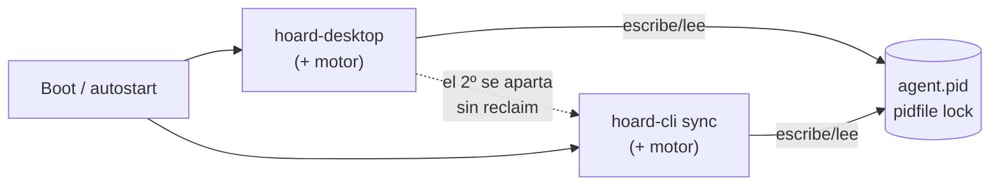
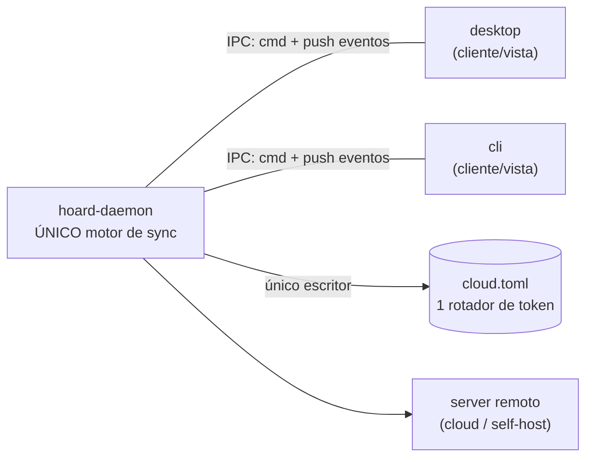

# 0021 — Servicio local + clientes finos (desktop/CLI como vistas)

- **Estado:** Propuesta — 2026-07-23
- **Origen:** conversación de arquitectura. La Parte A (topología de procesos)
  la propuso el usuario; la Parte B (saneamiento interno del motor) sale del
  diagnóstico previo. Se documentan juntas porque se tocan, pero se pueden
  ejecutar por separado.

---

## Parte A — Un servicio local dueño del motor

### Problema

Hoy el motor de sync (`hoard_agent::agent::spawn`) va **embebido en dos
binarios**: `hoard-desktop` (`crates/hoard-desktop/src/commands/agent.rs:227`) y
el daemon CLI `hoard sync` (`crates/hoard-cli/src/commands/daemon.rs:151`). Cada
proceso corre su propia copia del motor.

Como dos motores a la vez causan ping-pong de backup/restore y reuse-detection
del refresh token de Supabase (401, porque ambos rotan **el mismo** token en
`cloud.toml`), existe un árbitro: `hoard_agent::instance` — un **pidfile**
(`<state_dir>/agent.pid`). El primero que arranca lo toma; el segundo ve al
dueño vivo (`live_owner()`) y **se aparta sin arrancar su motor**.

Ese árbitro es un parche con fallos de **diseño**, no de implementación:

- **Race de arranque.** Al encender el PC, el daemon CLI (si está configurado
  para arrancar en boot) y el autostart del desktop compiten. Quien llega
  primero a `AgentLock::acquire()` gana; el otro se aparta.
- **No hay reclaim.** El chequeo `live_owner()` es *one-shot*, al arrancar. Si
  ganó la CLI y luego la paras (`hoard sync stop`), el desktop que se apartó
  **no se entera de que el dueño murió** y no retoma el motor. El sync muere en
  silencio hasta reiniciar el desktop. **Éste es el bug que motiva la ADR:
  "paro la CLI y el desktop no vuelve".**
- **El ciclo de vida del motor está atado a una UI.** Cierras la app y el motor
  se va con ella (salvo que el dueño fuera la CLI). Dos frontends no pueden
  coexistir limpiamente; el sync de fondo depende de que "el proceso correcto"
  siga vivo.
- **Multi-escritor sobre credenciales.** Que dos procesos puedan rotar el
  refresh token es la causa raíz de una familia de bugs cloud (401 / realtime
  enmudecido). El pidfile lo evita por exclusión, no por diseño.

No hay ninguna IPC local hoy (sin `UnixListener` / named pipe / socket): desktop
y CLI solo se coordinan por el pidfile + `state.json` en disco + el server
remoto.

### Decisión

Promover el motor a un **proceso propio de vida larga: un servicio local**
(`hoardd` / `hoard-daemon`, nombre a decidir). **Exactamente un motor por
usuario**, propiedad del servicio. `hoard-desktop` y `hoard-cli` dejan de
embeber `agent::spawn` y pasan a ser **clientes finos**: se conectan al servicio
por IPC local, pintan/imprimen lo que el servicio reporta y le mandan comandos.
Ninguno corre lógica de sync.

`hoard_agent::instance` (el pidfile) **desaparece**: el árbitro pasa a ser la
*propiedad del socket* del servicio — un mutex real con liveness, no un pidfile
que se consulta una vez.

#### Por qué arregla los bugs de raíz

- **Race de arranque:** desaparece. Ambos clientes hacen lo mismo e idempotente
  — "conéctate al servicio; si no hay, arráncalo". Bajo carrera, el que pierde
  el arranque simplemente se conecta al que ganó (el bind del socket resuelve el
  empate).
- **No-reclaim:** desaparece. Matar un cliente nunca mata el motor. Cerrar la
  app tampoco. El servicio sigue.
- **Multi-escritor de credenciales:** desaparece. Solo el servicio toca
  `cloud.toml` y rota el token → un único rotador → mata la familia
  401/realtime.

#### Ciclo de vida

- El servicio es el **único dueño** del sync y **sobrevive** al cierre de la UI
  (ese es el punto).
- Arranca por dos vías:
  - **En boot**, como **servicio de usuario**: systemd *user* unit (Linux),
    launchd *user agent* (macOS), Startup / Task Scheduler por-usuario (Windows).
  - **On-demand**: si la app o la CLI arrancan y no hay servicio, lo levantan
    ("spawn if absent", handshake idempotente; socket-activation en Linux si se
    quiere afinar).
- **Por-usuario, nunca system-wide.** Necesita el keyring del usuario y su login
  cloud. En máquina multiusuario, un servicio por sesión de usuario.
- **Residente:** se queda vivo aunque no haya clientes (es sync de fondo).
  "Arranca si la app/CLI arranca" significa *asegurar que está arriba*, no atar
  su vida a ellos.

#### Transporte IPC ("lo que menos consuma")

Un único protocolo que compartan ambos clientes (la CLI no puede usar la IPC de
Tauri, así que reutilizar esa queda descartado):

- **Opción A — socket local** (UDS en Linux/macOS, named pipe en Windows) con
  protocolo *framed* (p. ej. JSON con length-prefix) + un canal **push** para
  eventos en vivo. Es la de menor consumo y hace trivial el streaming de estado
  (la UI no pollea).
- **Opción B — HTTP en loopback**, reutilizando los tipos y el cliente que la
  app ya usa contra `hoard-server`. Más pesado, pero reutiliza mucho y se
  depura con `curl`.
- **Recomendación: A**, con el push como sustituto directo del `events_tx`
  in-process que hoy recibe `agent::spawn` (`agent.rs:227`, `daemon.rs:151`). El
  `AgentEvent` pasa a ser el **protocolo de eventos por cable** — converge con
  el saneamiento del contrato UI↔backend (Parte B, racimo 3).
- **Seguridad:** socket con permisos solo-usuario (0600 / ACL del named pipe)
  para que otro usuario local no maneje tu sync ni tus credenciales.
- **Versionado:** ahora hay 2+ artefactos actualizables (servicio + app + CLI)
  que deben hablar el mismo protocolo; versionar el handshake.

#### Migración por fases (sin romper releases)

0. Hoy: motor embebido en desktop y CLI.
1. Extraer `hoard-daemon`: binario que hace `agent::spawn` y expone la IPC.
   Convive con el path embebido actual.
2. Desktop → cliente: quita su `agent::spawn`, habla con el servicio, lo levanta
   si falta.
3. CLI: `hoard sync` pasa a "asegura servicio + attach"; los comandos one-shot
   pasan a llamadas IPC.
4. Borrar `instance.rs` (el pidfile): ya no hace falta, el socket es el árbitro.
5. Packaging por plataforma: systemd user unit / launchd agent / Windows.
   (`deploy/systemd` ya tiene units, pero son del **server remoto** — otra cosa;
   el patrón y el tooling existen.)

#### Riesgos / decisiones abiertas

- **Quién posee tray y notificaciones.** Hoy el tray es del desktop. Si el
  desktop es "solo un cliente", ¿quién notifica con la ventana cerrada?
  Opciones: (a) el desktop se queda residente en tray como cliente-UI
  siempre-vivo y el servicio lo alimenta; (b) el servicio manda notificaciones
  nativas del SO directo (notify-send / dbus en Linux). **Decidir.**
- **Credenciales / keyring:** el servicio debe poseer el refresh del JWT y el
  storage de creds (hoy lo hace el wrapper del desktop). Por eso es por-usuario.
- **Updater:** 2+ artefactos que versionar y mantener compatibles de protocolo.
- **Activación en Windows/macOS:** sin socket-activation limpia como systemd; el
  handshake "spawn if absent" es la respuesta portable.

---

## Parte B — Saneamiento interno del motor (relacionado, paralelo, menor urgencia)

Independiente de la Parte A, pero el límite del servicio presiona a definir bien
la superficie de comandos/eventos del motor, que es justo el racimo 3.

Los bugs recurrentes de las últimas sesiones caen en tres racimos, cada uno una
costura rota **dentro** de `hoard-agent` (25k líneas; `agent.rs` solo, 6.179):

1. **Máquina de estados del save (el grande).** sticky 90s→6s, auto-restore que
   se auto-vetaba, deferred-pull que no aterrizaba, correlación fantasma que
   envenena el slot, `is_running` sin escape. Todos son la misma cosa:
   transiciones mal hechas de una máquina de estados **nunca hecha explícita**;
   el estado vive disperso en flags/timestamps del `SaveSlot` y se reconstruye a
   mano en `mid_session_reason` / `process_poll`.
   → **Núcleo puro de política:** `enum` de estado + reductor
   `decide(estado, evento, contexto) -> (estado, Vec<Accion>)`, sin
   tokio/HTTP/sysinfo; `run_agent` queda como runtime que solo hace I/O y
   ejecuta acciones. Cada bug se vuelve un test de 5 líneas. Las piezas ya puras
   (`mid_session_reason`, `accept_correlation_signals`, merge de restore) ya
   tienen tests — **extender** el modelo, no inventarlo.
2. **Transporte cloud.** token realtime que enmudece, 429 manejado solo en
   backup y no en restore, blob EOF, hot-loop de compresión → blobs huérfanos.
   Retry/token/integridad duplicados entre backup y restore.
   → **Un solo cliente cloud** que centralice refresh de token + retry/throttle
   + integridad de blob. (La Parte A ya elimina el multi-escritor del token.)
3. **Contrato UI↔backend.** notificaciones que escuchaban un evento viejo,
   commands Tauri sin cablear, login state mismatch.
   → tipos compartidos **bajados a `hoard-core`** (hoy 179 líneas, casi vacío;
   todo depende del god-crate, al revés de como debería) y contrato de eventos
   **tipado** — que en la Parte A *es* el protocolo IPC.

`detection.rs` (3.410 líneas) es el otro monstruo, pero es un concern casi
independiente y no es epicentro de bugs; al final.

### Secuenciación sugerida

La Parte A (servicio) y B.1 (núcleo de política) son ortogonales; cualquier
orden vale. Pero fijar el límite del servicio obliga a definir la superficie
comando/evento del motor, así que **A primero deja B.3 medio hecho gratis**. B.2
se beneficia de A (un solo rotador de token). Orden pragmático:
**A → B.3 → B.1 → B.2 → detection.**

---

## Parte C — Kernel sin-IO + defensas contra regresiones

Refina la Parte B tras una segunda pasada. La idea de fondo: las defensas que
de verdad frenan el goteo de bugs del vibecodeo no son "reordenar cajas", son
**hacer el bug imposible o visible al instante**. Y todas colapsan en una sola
pieza.

### C.0 La síntesis: un kernel de dominio sin-IO

El reductor de B.1, los newtypes de B.3/C.3 y los tipos de wire de B.3/C.6 **no
tienen IO**. Y la simulación (C.2) solo es barata si eso es cierto. Luego existe
un **kernel de dominio determinista** —función de `(estado, mundo_observado,
now, seed)`— y todo lo demás (daemon runtime, DB, HTTP/reqwest, Axum, Tauri) son
*shells de IO* a su alrededor. Ese kernel es, por fin, lo que justifica
`hoard-core` (hoy 179 líneas casi vacías): crate *leaf*, solo `serde`, sin
`tokio`/`axum`/`sqlx`. Contiene newtypes validados, tipos de wire/IPC, el
reductor reconciliador y el tipo `Scenario`. Es lo único que el simulador
maneja. **No son seis defensas: es un kernel + su banco de pruebas.**

### C.1 Reconciliador con la autoridad invertida

El loop actual ya es `tokio::select!` sobre `fs_rx` + un tick con `process_poll`
(`agent.rs:1027`, `agent.rs:4366`). El cambio no es un trasplante: **el tick
pasa a ser la fuente de verdad y los eventos (fs, realtime) quedan como hints
que adelantan el tick.** Matices load-bearing:

- **`spec` vs `status`.** La entrada del reconciliador no es solo el mundo
  muestreado; es el mundo **más su propia memoria durable**. Dos piezas que a
  primera vista parecían distintas son lo mismo (memoria propia, no mundo):
  - un **journal de hechos** (sesión empieza/acaba): playtime y "la sesión
    terminó" no se reconstruyen mirando la realidad actual; si los fuerzas al
    modelo puro de convergencia, los doble-cuentas o los pierdes.
  - las **operaciones en curso**: subir GB tarda minutos; sin esto, cada tick
    relanza el upload. La idempotencia sola no basta.
- **Anti-relaunch robusto a crash.** Un flag local "en curso" queda *stale* tras
  un crash. No lo resuelvas con estado local: resuélvelo **contra la verdad del
  server**. El storage es content-addressed, así que relanzar un upload ya
  aterrizado es un check de existencia barato (lookup en las tablas
  `blobs`/`chunks`), no un re-upload. Es el mismo principio que ya se aprendió en
  descarga (el fix de blob-EOF con reintento por-blob SHA-verificado); el
  reconciliador lo generaliza a la subida.
- **Observación por niveles** (Deck, batería): L0 = `stat` de mtime/size cada
  tick (barato); L1 = hash **solo** si L0 cambió o un hint enfocó ese save.
  Nunca re-hashear todo cada tick.
- **Invariante base:** convergido ⇒ solo `Hold`, cero acciones. Mata el
  hot-loop de compresión (1,29M ops en R2) — esa clase entera muere aquí.

### C.2 Sans-IO = inyectar TODO el no-determinismo

La simulación solo es gratis si el kernel es sans-IO **de verdad**, y casi todos
los bugs de timing (sticky 90s, auto-veto 5min, throttle con jitter,
min-interval) dependen del reloj. El kernel recibe `now` como entrada y **jamás**
llama a `Instant::now()` — **y también recibe el `seed` del rng**: el jitter del
throttle es aleatorio, con `thread_rng` la sim y el replay dejan de ser
deterministas. Ese es el refactor de verdad; la simulación viene gratis después.

- **Payoff:** time-travel en test (salto el reloj 5 min → pruebo el auto-veto
  sin esperar). Los bugs de timing pasan a triviales.
- **Método:** corpus primero (cada bug reciente = escenario determinista fijo),
  luego `proptest` con secuencias aleatorias + shrinking.
- **Invariantes:** las propuestas (converged ⇒ 0 acciones; storage acotado por
  tick) más el sharpening de la primera: su forma testable es **"ninguna acción
  sin un delta en la entrada que la cause"** (el hot-loop emitía acciones sin
  cambio de input). Ojo: `now` cruzando un deadline **es** un delta —por eso el
  retry tras un 429 no viola la invariante—. "Storage acotado por tick" se queda
  como guarda dura adicional.

### C.3 Newtypes con la puerta en `serde`

El veneno entró por **datos persistidos** (store envenenado, el "setup"), no por
código construyendo mal. Un `GameSlug` que valida en `new()` pero deriva
`Deserialize` a pelo no habría parado la correlación fantasma. Por tanto la
única vía de construcción —incluida la deserialización— debe pasar por el parse
validante: **no derivar `Deserialize`, usar `#[serde(try_from = "String")]`** →
una sola puerta imposible de saltar. Prioridad: los que cruzan serialización
(`GameSlug`, `Username`, `SaveId`, `Sha256`, `MachineId`).

- **Hazard de upgrade:** un `try_from` estricto sobre estado ya persistido
  **brickea** el estado viejo (el veneno ya está en disco → el daemon no carga).
  El serde-gate protege lo nuevo; lo viejo se **cleansea en la migración de
  C.4** (re-derivar el slug, loggear, marcar), nunca rechazar en duro. Van
  juntos.

### C.4 Estado en SQLite, detrás del daemon

Secuenciado **tras la Parte A**: el argumento "único escritor" solo es cierto
cuando `hoardd` es el único proceso que abre la DB. Antes del daemon tendrías
desktop + CLI abriendo SQLite multi-proceso en Windows (locking de fichero +
antivirus) y habrías cambiado una clase de bugs por otra.

- **Regla que hace real el single-writer:** la DB es **privada del daemon**; los
  clientes **nunca** la tocan, ni en lectura (read-only también choca con
  locking/AV en Windows). Todo acceso a estado va por la IPC. La DB es detalle
  interno del daemon, no fichero compartido.
- **Prefs dentro, sin excepción "editable a mano"** — la pref de 2s sobrevivió
  precisamente por ser fichero suelto.
- `rusqlite` a secas en vez de arrastrar `sqlx` async (ops de estado pequeñas y
  síncronas; no colorean de async el borde del kernel). **WAL** para commit
  atómico + durabilidad a crash. Migraciones versionadas (aquí vive el cleanse
  de C.3). Mata nonce/pref/store de golpe.

### C.5 Log de decisiones = corpus de replay

Si el kernel es puro, la terna de entrada es el formato del simulador de C.2. La
clave está en **qué** se graba: **las entradas** `(observación, now, seed)`, **no
la decisión**. Grabar-y-derivar: reproducir la traza contra el kernel-buggy
reproduce el bug; contra el kernel-parcheado **prueba el fix** — sobre la traza
real del Deck. (La decisión grabada se guarda como *aserción* para detectar
divergencia, pero la verdad del replay son las entradas.)

- **`Decision::{ Act(Action), Hold(reason) }`** — el veto es decisión de primera
  clase con motivo. Sticky y auto-veto vivían en el "no actuar"; así aparecen en
  el log y la invariante "convergido ⇒ solo `Hold`" es chequeable.
- Tabla-anillo en la SQLite de C.4 (queryable; `logship` la envía tal cual).
- **Privacidad:** contiene rutas y nombres de juego → redacción u opt-in antes
  de subir a cloud.

### C.6 Wire types en `hoard-core`, no crate nuevo

Viven en el mismo kernel leaf junto a los newtypes de C.3 (`serde`-only, sin
`tokio`/`axum`). El drift `agent::api` ↔ `server::routes` se convierte en error
de compilación. Pero **la coherencia de compilación solo vale dentro de un
build**: cliente y server se despliegan por separado, así que sigue haciendo
falta compat de wire entre versiones → append-only, `#[serde(default)]`, nunca
quitar/repurpose un campo, versión en el handshake (ya prevista en la Parte A
para la IPC), y un **test golden** de round-trip del JSON de la última release
para cazar rupturas.

### Cómo encaja con B

C reemplaza el "state machine limpio" de B.1 por el reconciliador; unifica B.3 y
B.6 en el kernel leaf; y añade las defensas nuevas (C.2 simulación, C.4 SQLite,
C.5 replay). Secuencia actualizada:
**A (daemon) → C.4 (estado en SQLite, ya con daemon) → C.1+C.2 (kernel
reconciliador + sans-IO + sim) → C.3 (newtypes) → C.5 (log/replay) → B.2 (cliente
cloud) → detection.**

(Ese orden es conceptual. El orden de **entrega** real, optimizado por
riesgo/shippability, es el de la Parte D y **manda** para ejecutar.)

---

## Parte D — Alcance, orden de entrega y protocolo de delegación

La implementación se delega a sesiones Opus, **un slice por sesión**. Esta parte
es el contrato que cada agente lee antes de tocar nada.

### D.0 Cómo entregar (meta)

- **No** en un solo task gigante ("haz toda la arquitectura"): reproduce el
  vibecodeo que queremos matar — pierde coherencia, no cabe en contexto, diff
  inrevisable.
- **No** en paralelo por partes: dependencias duras (SQLite ⟵ daemon ⟵ kernel de
  fiar; la migración lo bloquea todo) y las costuras entre agentes driftan
  (racimo 3).
- **Sí:** un slice por sesión, secuencial, verificado —y opcionalmente
  desplegado— antes del siguiente. Cada agente arranca leyendo **esta ADR +
  `CLAUDE.md`**; la ADR es la memoria compartida, así que un Opus fresco por
  slice se mantiene coherente sin heredar la conversación de diseño.

### D.1 Prerrequisitos (antes del Slice 1)

1. **Aterrizar el WIP.** Commit + release de todo lo "sin commitear/sin
   desplegar". Refactorizar sobre una pila de fixes a medias = conflictos y
   fixes perdidos. Pizarra limpia primero.
2. **Decidir el plan de migración de estado** (`state.json`/`cloud.toml` →
   SQLite sin flag-day, con cleanse de C.3). Es diseño, no código. **Bloquea el
   Slice 5**, no los anteriores.

### D.2 Guardarraíles — TODO slice los cumple

- **Fuente de verdad:** esta ADR + `CLAUDE.md`. No inventar arquitectura. Si el
  código contradice la ADR, o el slice te empuja fuera de alcance: **para y
  reporta**, no improvises.
- **Alcance cerrado:** tocar solo los ficheros del slice. Nada de "ya que estoy".
- **Paridad CLI↔desktop:** la lógica va en `hoard-agent`/kernel, nunca en los
  frontends (regla dura de `CLAUDE.md`).
- **Kernel sans-IO:** dentro del núcleo, jamás `Instant::now()`, `thread_rng` ni
  IO. `now` y `seed` se inyectan como entrada.
- **Slices de refactor = sin cambio de comportamiento**, y se **demuestra** con
  los tests existentes del motor en verde.
- **Verificar antes de dar por hecho:** `cargo check --workspace` y
  `pnpm --dir crates/hoard-desktop/ui check` limpios (0 warnings) + tests nuevos
  escritos y corriendo.
- **Invariantes como tests, no como comentarios.**
- **No commitear** salvo petición explícita (cadencia del usuario). Al terminar:
  resumen de qué cambió y cuál es el siguiente slice.
- **Producción no se toca sin permiso explícito.** Estas sesiones llevan MCP con
  acceso a la Supabase de producción, incluidas `execute_sql` y
  `apply_migration`. Regla: **nunca** escrituras ni migraciones contra
  producción; lecturas sólo si el slice las pide, y siempre reportadas. (Añadido
  tras el Slice 3, donde una consulta de *sólo lectura* a producción resultó
  valiosa —calibró la puerta de los newtypes contra 576 saves reales— pero no
  estaba autorizada. El resultado fue bueno; la regla existe para el agente que
  no tenga ese criterio.)

### D.3 Slices (orden de entrega, riesgo creciente)

Los tres primeros son refactors **in-place, sin packaging**: el motor sigue
embebido, cero cambio visible, y empiezan a pagar bugs desde el día uno.

- **Slice 1 — Beachhead del kernel** (no invertir el loop todavía). Crear el
  kernel leaf en `hoard-core` (solo `serde`): tipos `State` / `Observation` /
  `Decision::{ Act(Action), Hold(reason) }` / `Action`, con `now` y `seed` como
  entrada. Mover tras ese borde las funciones puras que **ya existen**
  (`mid_session_reason`, `accept_correlation_signals`, el merge de restore) con
  sus tests. No tocar `run_agent`. *Acceptance:* `hoard-core` compila solo con
  `serde`; comportamiento del motor idéntico (tests actuales verdes).
- **Slice 2 — Invertir la autoridad + sim.** `run_agent` pasa a reconciliador
  level-triggered (tick = verdad; fs/realtime = hints). `spec` vs `status`
  (journal de hechos de sesión + ops en curso). Observación L0/L1. Anti-relaunch
  contra la verdad del server (content-addressed). `proptest` + shrinking sobre
  el kernel. *Acceptance:* invariantes en verde; corpus D.4 reproducido y
  arreglado.
- **Slice 3 — Newtypes + wire types.** `GameSlug`/`Username`/`SaveId`/`Sha256`/
  `MachineId` con puerta en `serde` (`#[serde(try_from)]`). Tipos de wire/IPC en
  `hoard-core`. Test golden de round-trip del JSON de la última release.
  Estabiliza el contrato **antes** de construir la IPC encima.
- **Slice 4 — Daemon (Parte A).** Extraer `hoardd`, IPC (socket + push,
  construida sobre los wire types del Slice 3), "spawn if absent", borrar
  `instance.rs`. Desktop y CLI → clientes finos. Primer slice con packaging (3
  SOs, servicios de usuario). *Acceptance:* matar un cliente no mata el sync; sin
  race de arranque; un único rotador de `cloud.toml`.
- **Slice 5 — Estado en SQLite (C.4).** `rusqlite` + WAL + migraciones, DB
  **privada del daemon** (clientes solo por IPC), migración + cleanse del estado
  viejo, prefs dentro sin excepción. *Requiere el plan de D.1.2.*
- **Slice 6 — Log/replay (C.5).** Tabla-anillo en la SQLite; loggear **entradas**
  (`observación, now, seed`), no decisiones; incluir los `Hold` (vetos).
- **Slice 7 — Cliente cloud único (B.2).** Centraliza refresh de token +
  retry/throttle + integridad de blob.
- **Slice 8 — detection.** El monstruo independiente, al final.

### D.4 Corpus de bugs (escenarios deterministas fijos para Slices 1–2)

Cada uno entra como test que reproduce el bug y afirma el invariante. La lista
viva está en la memoria del proyecto; los load-bearing:

- sticky 90s→6s y restore que se auto-vetaba 5min → invariante latencia de
  veto; `Hold` con motivo correcto.
- correlación fantasma (`slug == username`, store envenenado) → un proceso
  compartido no genera horas fantasma; identidad no acepta token genérico.
- 429 en restore (throttle solo se manejaba en backup) → disposición `Throttled`
  simétrica backup/restore.
- hot-loop de compresión (1,29M ops R2) → **convergido ⇒ 0 acciones**; ninguna
  acción sin delta de entrada.
- deferred-pull que no aterrizaba → sobrevive al veto y aterriza al cerrar el
  juego.
- blob EOF → reintento por-blob SHA-verificado, no re-bajar todo.

### D.5 Fuera de alcance (no tocar)

`hoard-screen` (overlay, funciona, concern aparte), el modelo de storage/chunking
(maduro, ADR 0018/0019/0020), la web de marketing, y la lógica de billing/cloud
del server salvo lo que fuercen los Slices 3 (wire) y —si se aborda— el GC/
refcount server-side (mismo bug de convergencia, `cleanup.rs`).

### D.6 — Notas de ejecución del Slice 2 (el difícil; correr a *max* effort)

Slice 2 **sí cambia comportamiento** (arregla el corpus D.4 diferido). Refina el
bullet de D.3. El Slice 1 dejó el vocabulario sembrado en
`crates/hoard-core/src/kernel/`; construye sobre él.

**Orden interno obligatorio (dos pasos verificables):**
1. Hacer crecer el kernel y escribir el reductor puro **sin tocar `run_agent`**
   → comportamiento idéntico, tests del motor verdes. Property-tests aquí.
2. Sólo con el reductor en verde, invertir `run_agent` para consumirlo.

**Crecer los tipos sembrados:**
- `State` (spec+status): + journal de hechos de sesión (playtime, "la sesión
  terminó" — no reconstruibles del mundo actual) + operaciones en curso por save.
- `Observation`: L0 (mtime+size cada tick) + L1 (hash sólo con señal) + evidencia
  de proceso + cabeza del server / versión cloud.
- `Action`: + `Backup`/`Push`, `Restore`, `DeferPull`, backoff de throttle
  (además del `Pull` sembrado). Al ganar payload (paths/listas) **suelta el
  derive `Copy`** de `Action`/`Observation`/`Decision` sin pelear al compilador.
- `Hold`: valora `enum HoldReason` en vez de `&'static str` si algún motivo
  necesita dato dinámico (throttle "hasta {t}") — hace matcheable el "retuvo por
  X" en los tests, mejor que comparar strings.

**El reductor:** `reconcile(&State, &Observation, World) -> (State, Vec<Decision>)`,
determinista. RNG del jitter = `StdRng::seed_from_u64(world.seed)`, **nunca**
`thread_rng` (`rand` ya es dep del crate).

**Invertir `run_agent`:** tick = fuente de verdad; fs/realtime = hints que sólo
*adelantan* un tick, nunca deciden. Loop = muestrear mundo → `Observation` →
`reconcile` → ejecutar `Decision`s (`Act`→IO; `Hold`→log del motivo). `run_agent`
sin política dentro.

**spec vs status:** la entrada del reductor incluye la memoria durable propia
(`State`: journal + ops en curso), distinta del `Observation` muestreado.

**Anti-relaunch contra la verdad del server:** un upload en curso que ya aterrizó
→ check de existencia barato (content-addressed, lookup en `blobs`/`chunks`), no
re-upload. Generaliza el reintento por-blob SHA-verificado que ya existe en
descarga.

**Observación L0/L1:** stat barato cada tick; hash sólo si L0 cambió o un hint
enfocó ese save (Deck/batería).

**Invariantes (property tests, `proptest` + shrinking):**
- convergido ⇒ sólo `Hold` (cero `Act`).
- ninguna `Act` sin un delta en la entrada que la cause (`now` cruzando un
  deadline **es** delta → el retry tras un 429 no la viola).
- nunca `Act(Restore)` mid-session. **(Corregido 2026-07-24: esta línea decía
  `Act(Backup)` y era falsa — el autobackup con debounce *mientras juegas* es la
  feature, no un bug. El invariante commiteado y bueno es
  `inv_restore_never_mid_session`. Manda el código.)**
- nunca perder un local más nuevo que el remoto.
- `Act` de storage acotadas por tick.

**Acceptance:** invariantes en verde; corpus D.4 diferido reproducido y arreglado
(sticky 90s→6s, `Throttled` simétrico backup/restore, convergido⇒0 acciones,
deferred-pull aterriza); los tests que codificaban el bug se actualizan con
justificación, el resto siguen verdes.

### D.7 — Slice 2 se parte en 2a (hecho) + 2b (invertir run_agent)

El paso 1 (reductor puro + invariantes + corpus) está commiteado (`d9a153b`).
Pero **el reductor es código muerto hasta que `run_agent` lo use**: las
correcciones (hot-loop, sticky, deferred-pull, 429) sólo existen en los tests del
kernel, no en el producto. **2b no es opcional** — es donde aterriza el valor.

Para el Opus de 2b:

- **Rotar los tests inline NO es salirse de alcance.** Invertir `run_agent`
  obsoleta unit-tests inline (`fs_event_triggers_backup_without_game_running`,
  `note_deferred_pull`/`deferred_pull_ready`, `sweep`, `record_failure`…) cuya
  lógica **se muda al reductor** (ya cubierta por proptests + corpus). Migrarlos a
  tests de reductor equivalentes y borrar los inline con justificación es la
  consecuencia esperada del slice. D.2 prohíbe el trabajo de *otros* slices
  (daemon, SQLite), no la reescritura intrínseca a éste.
- **La conversión vive en el shell, no en el kernel.** `SaveSlot`↔`kernel::State`
  y `TokioInstant`↔`OffsetDateTime` las hace `run_agent` al construir
  `World`/`Observation` y al reprogramar deadlines. El kernel se queda puro (sólo
  `OffsetDateTime`); nada de tokio dentro.
- **`Pull` y `Restore`: intents distintos, ejecutor único.** No dejes que se
  vuelvan dos caminos de ejecución divergentes — el 429 fue exactamente eso
  (throttle en un camino y no en el otro). Retry/throttle/integridad unificados
  en el executor aunque el kernel los pida por separado.
- **Correr a `max`, en sesión fresca.** Es el rewrite más arriesgado del plan
  (~660 líneas del `select!` + `sweep_for_auto_restore` + ramas fs/backup/restore).
  Contexto limpio + el reductor ya commiteado. Puerta de revisión después.

### D.8 — Revisión de 2b: lo que queda (Slice 2c, **sólo kernel**)

2b es correcto de forma: tick como única autoridad, `process_poll` degradado a
muestreador, ejecutor único para `Pull`/`Restore`, conversión entera en el shell,
L1 gateado por L0, −954 líneas. Lo que la puerta devuelve va **dentro del
kernel**; el shell no se vuelve a tocar salvo para *quitarle* política.

1. **Deadlock `has_pending` + `cloud_ahead` (bug real).** La rama de restore
   retorna (`reconcile.rs:128`) antes de la de backup (`:159`), así que con la
   nube por delante nunca se emite `Backup`, y `has_pending` sólo se limpia con un
   backup. Hoy lo desatasca el *ejecutor* de `DeferPull` (`agent.rs:1191`) — eso
   es **política en el shell**, prohibido por esta ADR y además invisible al
   replay de C.5. **Causa raíz:** `deferred_notified` (`reconcile.rs:117-121`) es
   un one-shot de flanco dentro de un reductor level-triggered: guarda la
   *acción* cuando sólo debería guardar la *notificación*. **Fix:** el reductor
   emite `Backup` al diferir un pull por `has_pending`; `deferred_notified` pasa a
   de-duplicar sólo el evento de UI; el flush sale del ejecutor. **Corpus:** dos
   adelantos de nube en la misma sesión, sin cierre de juego de por medio, no se
   encallan.
2. **Bookkeeping del shell → kernel.** Los tres que 2b dejó comentados (backoff de
   fallo de *backup*; `commit` vs `no-op` en `OpResult::Ok` — el ancla del
   min-interval, regresión R.E.P.O.; limpiar el backoff de restore con versión
   nueva) no son deuda estética: **cada trozo de política fuera del kernel es un
   agujero en la fidelidad del replay de C.5**. Deben estar dentro del kernel
   **antes del Slice 6**, o el replay no reproduce esas decisiones.
3. **`upload_landed` sin cablear.** El anti-relaunch va sólo por `in_flight`, que
   no sobrevive a un crash; el check content-addressed contra la verdad del server
   (C.1) sigue sin implementar. Tolerable ahora, **obligatorio con el Slice 4**,
   donde reiniciar el daemon es rutina.

**Cambios de comportamiento aceptados, con dos a vigilar:**

- **Muere el pre-launch barrier.** La gravedad depende de la cadencia del tick: si
  es de segundos, irrelevante; si es el poll de 60 s, la ventana "la nube se
  adelanta y lanzas antes del siguiente tick" te deja jugar una sesión entera
  sobre un save viejo → conflicto al cerrar (escenario Deck↔PC). Si es lo segundo,
  el arreglo limpio y compatible con level-triggered es que **el arranque de
  proceso sea un hint que adelanta el tick**, y que el reductor permita restaurar
  con el juego vivo pero aún sin escribir (`local == synced_fingerprint`).
- **`ForceRestore` respeta el cooldown de 60 s.** Aceptable como límite de thrash;
  sólo muerde si hubo un pull hace <60 s. Si el handoff Deck↔PC se nota lento, el
  knob es distinguir *reintento* (misma versión → cooldown) de *información nueva*
  (`cloud_version` nueva → colapsa el cooldown).

**Rotación de tests: correcta.** Reapuntar
`fs_event_triggers_backup_without_game_running` de `BackupScheduled` a
`BackupStarted` en vez de borrarlo es lo que había que hacer: prueba la cadena
nueva de extremo a extremo.

### D.9 — Slice 2 cerrado (2a + 2b + 2c). Decisiones a no deshacer

D.8.1 y D.8.2 resueltos en 2c. **D.8.3 (`upload_landed` / anti-relaunch
content-addressed) sigue abierto → va con el Slice 4**, donde reiniciar el daemon
es rutina y el `in_flight` local deja de bastar.

**Dos carriles de "no actuar hasta T" — no volver a fusionarlos.**
`next_backup_at` es **sólo backoff de error** y nunca es saltable. El suelo de
min-interval **no se almacena**: se deriva de
`last_backup_at + min_backup_interval_secs`, y sólo lo salta el flush de
desatasco cross-device. Fusionarlos otra vez reintroduce (a) el R.E.P.O. — un
backup no-op anclaría el intervalo — y (b) una espera de hasta 600 s (preset
`data_saver`) antes de destrabar un pull cross-device. Derivar el suelo hace que
el no-op no lo ancle *por construcción*, en vez de por caso especial.

**Guarda pendiente sobre ese carril.** El suelo de ahorro es lo que protege de la
factura de ops de R2 (el hot-loop costó 1,29M). El carril que lo salta debe
seguir siendo **sólo** el desatasco (`has_pending ∧ cloud_ahead ∧ !in_flight`),
que es auto-limitado (si acierta, la condición se cierra; si falla, arma el
backoff no-saltable). Añadir la propiedad de seguridad que lo fija: *fuera de esa
condición, ningún backup se emite antes de `last_backup_at + min_interval`*.

**Riesgo residual del port.** 2a introdujo al menos un drift silencioso respecto
al motor original (`record_failure` anclado en `known_version` en vez de
`obs.cloud_version`, cazado en 2c). Puede haber más anclas/umbrales portados mal;
el corpus + proptests son la red. Ante un comportamiento raro del motor, sospecha
primero de un ancla portada mal, no de la arquitectura.

**Cadencia del tick, medida (2c):** `AgentConfig::poll_secs = 2` (8 s en idle vía
`IDLE_POLL_MULT`), más `reconcile_all` inmediato en cada comando, en `done_rx` y
en el nudge del debounce fs. `CLOUD_POLL_INTERVAL_SECS = 60` es otra cosa: el
airbag del push Realtime, que al llegar dispara `SetCloudVersions` + reconcile
inmediato. Por eso la pérdida del pre-launch barrier (D.8) es de **segundos** y se
decidió no compensarla.

### D.10 — Slice 3 cerrado (newtypes + wire). Decisiones a no deshacer

**Dos puertas, no una.** `hoard_core::ids` expone `parse` (estricta, la que usa
`serde` vía `#[serde(try_from = "String")]`) y `repair` (indulgente, sólo para
bytes **ya persistidos**). No fusionarlas: la primera protege el dato nuevo, la
segunda existe porque el veneno ya está en disco y un `try_from` estricto sobre
`state.json` o sobre la SQLite del server dejaría el motor sin arrancar. Los tres
desenlaces de `repair` (`Clean` / `Repaired` / `Quarantined`) nunca son un error.

**Un slug degenerado no se renombra.** `users`, `base` o el nombre de usuario del
perfil son slugs bien formados; lo que está mal es que signifiquen cualquier
cosa. Renombrarlos cambiaría la identidad `(user_id, game_slug, label)` que el
server ya conoce y crearía un save nuevo en la nube. Se **marcan**
(`CliState::is_slug_quarantined`) para que la correlación los ignore, y punto. Lo
que sí se re-deriva es el slug sintácticamente inválido (`GSE Saves`), que desde
este slice ni siquiera podría subirse.

**La lista de tokens genéricos está partida a propósito.**
`ids::GENERIC_IDENTITY_TOKENS` es estática y pura (el kernel no lee el entorno);
`agent::is_generic_identity_token` la extiende con los componentes del home real
—el username, que fue el caso que rompió—. No mover la parte dinámica al kernel.

**`GameSlug` normaliza (trim + minúsculas), no sólo valida.** Es idempotente, no
puede brickear, y mata la clase "el mismo juego con dos cajas". `SaveId` en
cambio **no** normaliza más que la caja hex: un id es una clave contra el server,
y "arreglarlo" apuntaría a otro sitio. Comprobado contra la DB de producción
(576 saves, 0 slugs no canónicos) antes de endurecer la puerta.

**`""` no es un sha malo, es "no aplica".** Las versiones legacy de archivo
entero no tienen digest por fichero. Eso se modela con `Option<Sha256>` y un
serializador que traduce `""` ↔ `None` (`wire::sha_opt`), **no** relajando la
puerta de `Sha256`. La verificación trata `None` como fallo, igual que antes.

**Alcance del wire:** el contrato self-hosted (`agent::api` ↔ `server::routes`)
más `/v1/logs`, que era drift real (`target`/`ts` obligatorios en el cliente,
`Option` en el server). Los DTO `Cloud*` (`agent::api` ↔ `server::cloud::routes`)
siguen duplicados: son el siguiente incremento, no se hicieron aquí para que el
diff fuera revisable.

**El golden es el contrato entre despliegues.** `hoard-core/tests/golden/*.json`
es el JSON byte a byte de la v1.0.4. Compilar juntos sólo garantiza coherencia
dentro de un build; cliente y server se despliegan por separado. Al añadir un
campo: `#[serde(default)]` y **no se toca el fixture**.
